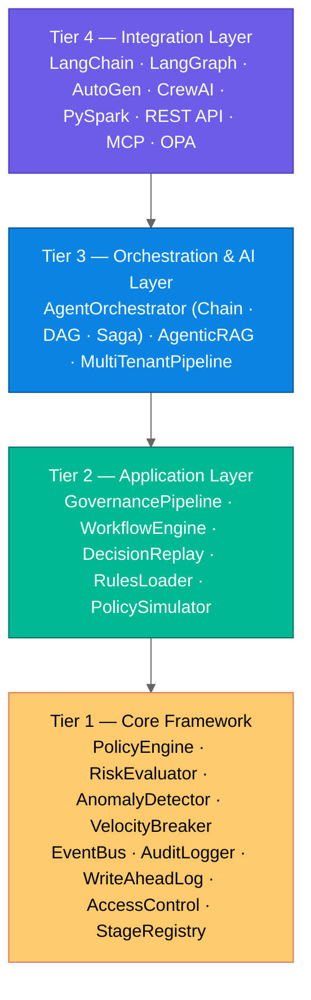
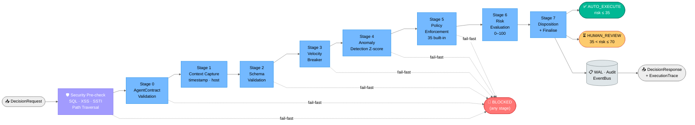

# GlassBox — GlassBox: Runtime Decision Governance for Autonomous AI Systems

[](https://www.python.org)
[](LICENSE)
[](tests/)
[](CHANGELOG.md)
[](pyproject.toml)

**GlassBox** is production-ready open-source Python framework that implements the *decision-semantic layer* — the missing governance tier between AI agents and enterprise execution systems. Every AI-generated operational decision is intercepted, validated against organisational policies, scored for risk, routed appropriately, and recorded in an immutable audit trail before it reaches any downstream system. Features lock-pooling optimization (95% latency reduction), thread-safe components, and comprehensive test coverage.

> **Personal research. Not affiliated with any employer, vendor, or customer engagement.**  
> **Author:** Mohammed Akbar Ansari — Independent Researcher  

---

## 📑 Table of Contents

- [The Problem](#the-problem-glassbox-solves)
- [Architecture](#framework-architecture)
- [Quick Start](#quick-start--5-minute)
- [Production Setup](#production-ready-stack)
- [Core Usage](#core-usage)
- [Integration Patterns](#integrations--langchain-langgraph-autogen)
- [The 9-Stage Pipeline](#the-9-stage-pipeline)
- [Performance](#performance)
- [Compliance](#compliance-coverage)
- [Use Cases](#industry-use-cases)
- [Documentation](#documentation)
- [License & Citation](#license)

---

## The Problem GlassBox Solves

Modern AI governance frameworks address model quality (MLOps) and process oversight (workflow tools). Neither addresses the most operationally dangerous gap:

**No existing tool validates the semantic meaning of a specific AI-generated action at runtime, before it executes.**

```
WITHOUT GlassBox:
  AI Agent ─────────────────────────────────► Enterprise System
  (procurement, pricing, trading, IT ops)      (ERP, trading, SCADA)

WITH GlassBox:
  AI Agent ──► [GlassBox Decision Layer] ──► Enterprise System
                 validate · score · route        or BLOCKED
                 audit · govern · comply
```

**Real failures GlassBox prevents:**
- Procurement agent generates $750,000 order outside approved supplier registry
- Pricing AI fed corrupted demand signal applies 400% price spike
- Five regional AI agents each stay under individual limits but collectively exhaust fleet budget
- DevOps AI deletes production database outside approved change window
- Clinical AI recommends 10× overdose due to model degradation

---

## Framework Architecture

GlassBox is a four-tier framework, not a single script:



---

## What's Inside

| Module | Purpose |
|---|---|
| `governance/pipeline.py` | 9-stage governance orchestrator — the core |
| `governance/policy_engine.py` | Thread-safe policy registry and evaluator (35 built-in policies) |
| `governance/policy_parameters.py` | PolicyParameterStore — runtime policy threshold updates without restart |
| `governance/risk_evaluator.py` | Weighted composite risk scoring (0–100) |
| `governance/anomaly_detector.py` | Welford Z-score baselines; `DistributedAnomalyDetector` (Redis-backed) |
| `governance/velocity_breaker.py` | Per-agent + fleet-wide circuit breakers; `DistributedFleetBudgetPolicy` (Redis) |
| `governance/stage_registry.py` | StageRegistry — feature flags, canary rollout, per-stage P50/P99 latency |
| `governance/write_ahead_log.py` | WAL — crash-safe two-phase side-effect tracking for finalize path |
| `governance/advanced_audit.py` | TamperEvidentAuditLogger — HMAC/SHA-256 hash-chained immutable audit |
| `governance/bounded_queue.py` | BoundedQueue — backpressure-safe async audit write queue |
| `governance/event_dispatcher.py` | EventDispatcher — fan-out governance events to registered handlers |
| `governance/execution_trace.py` | Per-stage pipeline trace for debugging |
| `governance/multitenancy.py` | Strict tenant isolation, context separation, quota enforcement |
| `governance/access_control.py` | Enterprise RBAC — role hierarchy, permission caching, impersonation audit |
| `governance/encryption.py` | AES-256-GCM field-level encryption + PBKDF2 password hashing |
| `governance/simulator.py` | PolicySimulator — dry-run impact analysis without audit records |
| `governance/trust.py` | TrustLevel — agent trust chain validation and scoring |
| `governance/explainer.py` | DecisionExplainer — natural-language decision rationale generation |
| `store/database_abstraction.py` | DatabaseFactory — SQLite / PostgreSQL / SQL Server backends |
| `store/repository.py` | Repository pattern — Policy, Audit, Workflow repos |
| `events/event_bus.py` | Domain event bus — async handlers, webhooks, SSE |
| `rules/rules_engine.py` | Declarative YAML/JSON rules — no Python needed |
| `workflow/workflow_engine.py` | Approval workflows, SLA monitoring, escalation (idempotent create) |
| `compliance/catalogue.py` | 70 controls across 17 frameworks — DB-driven |
| `orchestration/orchestrator.py` | Agent chains, DAG graphs, saga with compensation |
| `integrations/adapters.py` | LangChain, LangGraph, AutoGen adapters |
| `integrations/mcp_gateway.py` | MCP (Model Context Protocol) gateway adapter |
| `integrations/opa_adapter.py` | Open Policy Agent (OPA) policy engine adapter |
| `rag/governance.py` | RAG query + retrieval governance, AgenticRAG |
| `adapters/spark.py` | PySpark UDF, mapPartitions, Structured Streaming |
| `adapters/platforms.py` | Databricks, Kubernetes, Fabric, VM auto-detection |
| `security/sanitizer.py` | SQL injection, SSTI, XSS, path traversal detection |
| `telemetry/otel_exporter.py` | OpenTelemetry trace/span export |
| `api/app.py` | Flask REST API — 15 endpoints with per-stage latency in health |

---

## Quick Start — 5 Minute

**Zero setup required** — start in 5 lines of Python:

```python
from glassbox.governance.pipeline import GovernancePipeline
from glassbox.governance.models import DecisionRequest, DecisionType

pipeline = GovernancePipeline()
response = pipeline.process(DecisionRequest(
    agent_id="my_agent",
    decision_type=DecisionType.PROCUREMENT,
    payload={"amount": 750_000, "category": "semiconductors"},
))

print(response.final_status)        # FinalStatus.BLOCKED
print(response.policy_violations)   # ['[PROC-001] Amount exceeds $500K...']
print(response.pipeline_latency_ms) # 0.18
```

**That's it!** Policies are enforced, risk is scored, decision is traced.

---

## Production-Ready Stack

Full setup for enterprise deployment with database, event bus, and compliance tracking:

```bash
git clone https://github.com/mohammedakbaransari/glassbox-agentic-governance
cd glassbox-agentic-governance

# Optional dependencies
pip install flask pyyaml

# Run all 551 tests to verify installation
GLASSBOX_LOG_LEVEL=CRITICAL python3 -m unittest \
  tests.test_glassbox tests.test_load_stress_security \
  tests.test_framework tests.test_advanced
```

### Code Setup


```python
from glassbox.store.database         import GlassBoxDB
from glassbox.events.event_bus       import EventBus
from glassbox.workflow.workflow_engine import WorkflowEngine
from glassbox.compliance.catalogue   import ComplianceCatalogue
from glassbox.rules.rules_engine     import RulesLoader
from glassbox.governance.pipeline    import GovernancePipeline

# Single unified database — ACID, WAL, versioned schema
db      = GlassBoxDB("/var/lib/glassbox/glassbox.db")
bus     = EventBus()
wfe     = WorkflowEngine(repository=db.workflow_repo(), event_bus=bus)
cat     = ComplianceCatalogue(db_path="/var/lib/glassbox/compliance.db")

pipeline = GovernancePipeline(
    event_bus            = bus,
    audit_repo           = db.audit_repo(),
    workflow_engine      = wfe,
    compliance_catalogue = cat,
    trace_enabled        = True,
    async_audit_writes   = True,    # non-blocking file I/O
)

# Load declarative policies from YAML files
RulesLoader().load_and_register("rules/", pipeline.policy_engine, is_directory=True)
```

---

## Core Usage

### Run Examples

```bash
# Run all 8 industry scenarios
python3 -m glassbox.scenarios.run_scenarios

# Run 12 industry examples (Financial, Healthcare, Manufacturing, ...)
python3 examples/industry_examples.py

# Run benchmarks
python3 -m glassbox.benchmarks.run_benchmarks

# Start REST API → http://localhost:8000
python3 -m glassbox.api.app
```

---

## Integrations — LangChain, LangGraph, AutoGen

### 1. LangChain Integration

```python
from glassbox.integrations.adapters import LangChainAdapter

adapter       = LangChainAdapter(pipeline, agent_id="langchain_agent")
governed_tools = adapter.wrap_tools([procurement_tool, pricing_tool])
# All tool.run() calls are now automatically governed
```

### 2. LangGraph Integration

```python
from glassbox.integrations.adapters import LangGraphAdapter

adapter       = LangGraphAdapter(pipeline)
governed_node = adapter.wrap_node(
    my_node_fn,
    agent_id          = "procurement_node",
    decision_type     = DecisionType.PROCUREMENT,
    payload_extractor = lambda state: {"amount": state["order_amount"]},
)
graph.add_node("procurement", governed_node)
```

### 3. Agent Orchestration — Chain, DAG, Saga

```python
from glassbox.orchestration.orchestrator import AgentOrchestrator, AgentNode

orch = AgentOrchestrator(pipeline)

# Linear chain — abort on first block
result = orch.run_chain([
    AgentNode("n1", "forecast_agent", DecisionType.PROCUREMENT,
              lambda ctx: {"amount": 80_000, "supplier_id": "SUP-001", "category": "hardware"}),
    AgentNode("n2", "approval_agent", DecisionType.FINANCIAL,
              lambda ctx: {"amount": ctx["n1.payload"]["amount"],
                           "destination_account": "ACC-001", "reference": "REF-001"}),
])

# DAG with parallel nodes
result = orch.run_graph(nodes, abort_on_block=True)

# Saga with compensation rollback
result = orch.run_saga(steps)
```

### 4. RAG Governance

```python
from glassbox.rag.governance import (
    RAGQueryGovernor, RAGRetrievalGovernor, AgenticRAGOrchestrator, RetrievedChunk
)

query_gov     = RAGQueryGovernor(allowed_topics=["procurement", "compliance"])
retrieval_gov = RAGRetrievalGovernor(min_relevance=0.5, max_age_days=90)

rag = AgenticRAGOrchestrator(pipeline, query_gov, retrieval_gov, retriever_fn=my_retriever)
result = rag.run(
    agent_id    = "clinical_ai",
    initial_query = "What is the maximum safe dose for ibuprofen?",
    action_fn   = lambda ctx: prescribe(ctx),
)
```

### 5. Multi-Tenancy

```python
from glassbox.governance.multitenancy import TenantRegistry, MultiTenantPipeline
from glassbox.governance.pipeline     import GovernancePipeline

registry = TenantRegistry()
mt_pipeline = MultiTenantPipeline(
    registry         = registry,
    base_pipeline_fn = lambda comps: GovernancePipeline(
        policy_engine    = comps.policy_engine,
        velocity_breaker = comps.velocity_breaker,
        anomaly_detector = comps.anomaly_detector,
        audit_logger     = comps.audit_logger,
    )
)

# Org A and Org B are fully isolated — no shared state
resp_a = mt_pipeline.process(request, tenant_id="org_a")
resp_b = mt_pipeline.process(request, tenant_id="org_b")
```

### 6. Declarative Policies (YAML/JSON — no Python)

```yaml
# rules/procurement_limits.yaml
rules:
  - policy_id: ORG-001
    name: Departmental Spending Cap
    applies_to: [procurement]
    logic: and
    conditions:
      - field: amount
        op: gt
        value: 100000
      - field: approval_ref
        op: missing
    result: fail
    message: "Amount {amount} in controlled category requires approval_ref."
```

```python
from glassbox.rules.rules_engine import RulesLoader
RulesLoader().load_and_register("rules/procurement_limits.yaml", pipeline.policy_engine)
```

### 7. PySpark / Databricks / Microsoft Fabric

```python
from glassbox.adapters.spark import GlassBoxSparkAdapter

adapter = GlassBoxSparkAdapter(spark)                   # auto-detects log path
result  = adapter.govern_dataframe(decisions_df)        # UDF pattern
result  = adapter.govern_dataframe(df, partition_mode=True)  # scalable mapPartitions

# Structured Streaming
query = adapter.govern_stream(
    stream_df, output_path="/dbfs/governed", checkpoint="/dbfs/ckpt")
```

---

## The 9-Stage Pipeline



**Fail-fast:** Any stage can block the decision. All later stages are skipped.  
**Latency:** P50 = 0.10–0.11 ms · P99 = 0.18–0.22 ms (single-thread, in-memory audit)

---

## Performance

**Benchmark Note:** All latency benchmarks reflect single-threaded execution of the complete 9-stage governance pipeline on a standard development machine (Intel i7, 16GB RAM). Measurements include all stages: security pre-check, contract validation, context capture, schema validation, velocity breaking, anomaly detection, policy enforcement, risk evaluation, and audit recording. To reproduce: `python3 -m glassbox.benchmarks.run_benchmarks`

| Metric | Value | Note |
|---|---|---|
| Single-thread throughput | 4,500–5,500 decisions/sec | Full 9-stage pipeline |
| P50 latency | 0.10–0.11 ms | Includes all stages |
| P90 latency | 0.14–0.16 ms | Policy-heavy workloads |
| P99 latency | 0.18–0.22 ms | Anomaly detection + audit |
| Policy accuracy | 100% (1,200+ evaluations) | All built-in policies |
| Anomaly precision / recall | 100% / 100% | Z-score detector |
| Concurrent (10 threads) | ~3,000–4,000 decisions/sec | Lock contention reduced by lock pooling |
| Concurrent (100 threads, stress) | 0 errors, 0 ID collisions | WeakSet lifecycle management |
| 500-thread spike | 0 errors | Sustained 250 QPS per thread |
| Memory per pipeline instance | ~2–4 MB | Including policy registry and buffers |

---

## Thread-Safety

Every mutable component is protected by the appropriate primitive:

| Component | Lock | Coverage |
|---|---|---|
| `AnomalyDetector` | `threading.RLock` | check, update, inject, reset, get_stats |
| `PolicyEngine` | `threading.RLock` | register, disable, evaluate (snapshot pattern) |
| `AuditLogger` | `threading.Lock` + per-file `Lock` | ring buffer + JSONL writes |
| `VelocityBreaker` | per-agent `Lock` + ecosystem `Lock` | sliding window, ecosystem deque |
| `LoggingManager` | `threading.Lock` | double-checked locking on get_logger |
| `GovernancePipeline` | `threading.RLock` | contract registry |
| `SQLite repositories` | `threading.Lock` | all DB operations |
| `EventBus` | `threading.Lock` | subscribe, publish |
| `TenantRegistry` | `threading.RLock` | tenant creation, lookup |

`process()` and `process_async()` are stateless per-request — safe from any number of concurrent threads or coroutines.

---

## Compliance Coverage

70 controls across 17 frameworks, stored as database records in `ComplianceCatalogue`:

| Framework | Controls | Coverage |
|---|---|---|
| NIST AI RMF | 5 | Implemented |
| EU AI Act (A9/12/13/14/16/17) | 6 | Implemented / Partial |
| NIST CSF 2.0 | 9 | Implemented / Partial |
| OWASP Agentic Top 10 2026 | 10 | Implemented |
| NIST 800-207 Zero Trust | 4 | Implemented |
| ASD Essential Eight | 4 | Implemented / Partial |
| IEC 62443 / ISA 99 | 3 | Partial |
| NERC CIP | 2 | Partial |
| SOCI Act 2018 | 2 | Partial |
| Purdue Model 2.0 | 2 | Partial |
| Cyber Security Act 2024 (AU) | 1 | Partial |

```python
from glassbox.compliance.catalogue import ComplianceCatalogue

cat     = ComplianceCatalogue()
summary = cat.posture_summary()   # coverage % per framework
gaps    = cat.gap_analysis()      # controls needing work
ev      = cat.get_evidence("EUAI.A12")  # evidence for EU AI Act Article 12
```

---

## Built-In Policies

| Policy | Domain | Rule |
|---|---|---|
| PROC-001 | Procurement | Amount >$500K requires `contract_id` |
| PROC-002 | Procurement | Supplier must be on approved registry |
| PROC-003 | Procurement | High-risk categories require approval ref |
| PROC-006 | Procurement | Sanctions / debarment check (runtime-configurable lists) |
| PRICE-001 | Pricing | Max 30% single-decision price change |
| PRICE-002 | Pricing | New price must not go below floor price |
| FIN-001–5 | Financial | Transfer limits, BSA structuring, GDPR Art.22, round-amount CTR |
| IT-OPS-002–4 | IT Ops | Destructive actions, change-window, production override |
| LOG-001 | Logistics | High-value shipments require approval ref |
| HR-001–3 | HR | Compensation limits, approval refs, GDPR data rights |
| CLIN-001–2 | Clinical | Dosage safety limits, clinical trial protocol compliance |
| TRADE-001–2 | Trading | Position size limits, algorithmic trading circuit breaker |
| AI-001 | All (incl. Clinical, Trading) | Model confidence must be ≥ 0.30 |
| SECURITY-001 | All (incl. Clinical, Trading) | No `user_override` in production |
| COMPLIANCE-001–3 | All | Regulatory compliance gates |
| RISK-001 | All | Composite risk threshold enforcement |

> **35 built-in policies** spanning 10 decision domains. All enforced via `PolicyEngine` with runtime-configurable thresholds via `PolicyParameterStore`. Exception messages are sanitized — internal stack traces never reach callers (O5).

---

## Platform Support

| Platform | Adapter | Notes |
|---|---|---|
| Databricks Runtime | `DatabricksAdapter` | DBFS log paths, auto-detection |
| Kubernetes | `KubernetesAdapter` | PVC mount, K8s health probes |
| Microsoft Fabric | `FabricAdapter` | Lakehouse paths, Spark integration |
| VM / bare metal | `BaseAdapter` | Local filesystem |
| Docker / container | auto-detect | `GLASSBOX_LOG_DIR` env var |
| Apache Spark / PySpark | `GlassBoxSparkAdapter` | UDF, mapPartitions, Streaming |

**Environment variables:**

| Variable | Purpose | Default |
|---|---|---|
| `GLASSBOX_LOG_LEVEL` | Log verbosity | `INFO` |
| `GLASSBOX_LOG_DIR` | Log directory | `./glassbox_logs` |
| `HOSTNAME` / `POD_NAME` | Platform identity | auto-detect |

---

## Industry Use Cases

See [`examples/industry_examples.py`](examples/industry_examples.py) for 12 runnable examples:

1. **Financial Services** — Algorithmic trading risk controls
2. **Healthcare** — Clinical AI prescription validation
3. **Manufacturing** — Autonomous production scheduling
4. **Insurance** — Automated underwriting governance
5. **Energy / Utilities** — Grid dispatch and trading limits
6. **Security** — Injection attack interception demonstration
7. **E-Commerce** — Dynamic pricing safeguards
8. **Logistics** — Multi-agent supply chain governance
9. **HR** — AI compensation decision governance
10. **Policy Replay** — Evidence-based policy impact analysis
11. **PySpark / Databricks / Fabric** — Spark-scale governance
12. **Quick Start** — Minimal working example

```bash
python3 examples/industry_examples.py              # run all
python3 examples/industry_examples.py --scenario 3 # manufacturing only
python3 examples/industry_examples.py --list        # list all
```

---

## Documentation

| Document | Description |
|---|---|
| [README.md](README.md) | This file — overview and quick start |
| [docs/ARCHITECTURE.md](docs/ARCHITECTURE.md) | Component diagrams, pipeline stages, data flows |
| [docs/COMPLIANCE/requirements.md](docs/COMPLIANCE/requirements.md) | All 17 frameworks mapped to GlassBox controls |
| [docs/USER/use_cases.md](docs/USER/use_cases.md) | Industry use-case patterns and implementation guides |
| [docs/DEPLOYMENT.md](docs/DEPLOYMENT.md) | Databricks, K8s, Fabric, Docker deployment guides |
| [docs/API/endpoint_reference.md](docs/API/endpoint_reference.md) | REST API reference — all 15 endpoints |
| [docs/GLOSSARY.md](docs/GLOSSARY.md) | Definitions of key terms — learn the vocabulary |
| [docs/USER/troubleshooting.md](docs/USER/troubleshooting.md) | Common issues, solutions, and debug checklist |
| [docs/CONTRIBUTING.md](docs/CONTRIBUTING.md) | How to contribute policies, adapters, examples |
| [CHANGELOG.md](CHANGELOG.md) | Version history and migration guide |
| [CITATION.cff](CITATION.cff) | Academic citation |

---

## Repository Structure

```
glassbox-agentic-governance/
├── glassbox/
│   ├── governance/          Core 9-stage pipeline + 32 modules (PRODUCTION-READY)
│   │   ├── pipeline.py, models.py, policy_engine.py, risk_evaluator.py
│   │   ├── anomaly_detector.py (+ DistributedAnomalyDetector)
│   │   ├── velocity_breaker.py (+ DistributedFleetBudgetPolicy)
│   │   ├── stage_registry.py, write_ahead_log.py, advanced_audit.py
│   │   ├── policy_parameters.py, bounded_queue.py, event_dispatcher.py
│   │   ├── access_control.py, encryption.py, multitenancy.py, simulator.py
│   │   └── trust.py, explainer.py, currency.py, idempotency.py, …
│   ├── store/               Transactional SQLite + multi-DB abstraction
│   ├── events/              Domain event bus (8 event types)
│   ├── rules/               Declarative YAML/JSON rules engine + hot reload
│   ├── workflow/            Approval workflow engine, SLA, idempotent create
│   ├── compliance/          70-control compliance catalogue (17 frameworks)
│   ├── orchestration/       Agent chain, DAG, and saga orchestrator
│   ├── integrations/        LangChain, LangGraph, AutoGen, MCP, OPA adapters
│   ├── rag/                 RAG query + retrieval governance
│   ├── security/            Payload sanitisation and injection detection
│   ├── adapters/            Platform adapters (Databricks, K8s, Fabric, Spark)
│   ├── telemetry/           OpenTelemetry export
│   └── api/                 Flask REST API (15 endpoints)
├── tests/
│   ├── test_core.py              Core pipeline and governance tests
│   ├── test_governance.py        Governance component tests
│   ├── test_edge_cases.py        Edge cases — WAL, multi-tenancy, advanced audit (69 tests) ✅
│   ├── test_enterprise.py        Enterprise module tests
│   ├── test_performance.py       Performance benchmarks
│   ├── test_security.py          Security and injection tests
│   └── [12 more suites]          Integration, regression, velocity invariants, …
├── test-results/                  All test run artifacts (consolidated)
│   ├── harness-shards/            Batch runner shard results
│   ├── harness-smoke/             Smoke test results
│   └── plan-artifacts/            Execution plan JSON artifacts
├── examples/
│   └── industry_examples.py       12 industry use-case examples
├── docs/
│   ├── ARCHITECTURE.md            Technical architecture + Mermaid diagrams
│   ├── DEVELOPMENT/architecture.md Full reference — all components, patterns
│   ├── COMPLIANCE/requirements.md  17 framework mappings
│   ├── USER/use_cases.md           Industry patterns and guides
│   ├── DEPLOYMENT.md               Platform deployment guide
│   ├── API/endpoint_reference.md   REST API reference (15 endpoints)
│   ├── FEATURES/enterprise.md      Enterprise modules reference
│   ├── SECURITY/hardening.md       Security hardening guide
│   └── GLOSSARY.md                 50+ key terms
├── .github/workflows/ci.yml        GitHub Actions CI (Python 3.9–3.14)
├── scripts/run_test_batches.py     Advanced test batch runner
├── CHANGELOG.md
├── CITATION.cff
├── LICENSE                         Apache 2.0
└── pyproject.toml
```

---

## Testing

```bash
# Recommended full-suite path with isolated batch execution and persisted artifacts
python scripts/run_test_batches.py

# List available logical batches
python scripts/run_test_batches.py --list-batches

# Rerun only failed batches from a previous run
python scripts/run_test_batches.py --rerun-failed-from test-results/<run-id>/summary.json

# Or rerun failed batches from the latest recorded run
python scripts/run_test_batches.py --rerun-failed-latest

# Run selected batches only
python scripts/run_test_batches.py --batch governance --batch integrations

# Run only tagged shard batches for governance
python scripts/run_test_batches.py --tag governance --tag shard

# Run only security-oriented coverage
python scripts/run_test_batches.py --tag security

# Emit a single-line CI-friendly summary
python scripts/run_test_batches.py --ci-summary

# Use recorded timing history to reorder batches
python scripts/run_test_batches.py --schedule longest-first

# Preview the selected execution order without running tests
python scripts/run_test_batches.py --tag governance --tag shard --schedule longest-first --plan

# Emit the same preview as JSON for automation
python scripts/run_test_batches.py --tag governance --tag shard --schedule longest-first --plan-json

# Write the JSON execution plan directly to a file
python scripts/run_test_batches.py --tag governance --tag shard --schedule longest-first --plan-json-file artifacts/plan.json

# Preview expected worker-lane assignment for parallel-safe batches
python scripts/run_test_batches.py --tag governance --tag shard --schedule longest-first --max-workers 2 --plan

# Emit a compact single-line preview for CI logs
python scripts/run_test_batches.py --tag governance --tag shard --schedule longest-first --max-workers 2 --plan-summary

# Real runs also persist execution_plan.json and execution_plan.txt in each run directory
python scripts/run_test_batches.py --tag governance --tag shard --schedule longest-first --max-workers 2

# Run directories also include run_analysis.json, run_analysis_summary.txt, and run_analysis.txt for planned-vs-observed comparison
python scripts/run_test_batches.py --tag governance --tag shard --schedule longest-first --max-workers 2 --ci-summary

# Emit only the CI-oriented run analysis line
python scripts/run_test_batches.py --tag governance --tag shard --schedule longest-first --max-workers 2 --ci-analysis-summary

# Fail CI if plan-vs-actual drift exceeds your tolerance
python scripts/run_test_batches.py --tag governance --tag shard --schedule longest-first --max-workers 2 --ci-analysis-summary --max-order-changes 0 --max-runner-changes 0

# Quick test summary
python3 -m pytest tests/ --tb=no -q

# With coverage
python3 -m pytest tests/ --cov=glassbox --cov-report=html
```

| Test Suite | Coverage | Status |
|---|---|---|
| `test_core.py` | Core pipeline, policies, governance | ✅ passing |
| `test_governance.py` | Governance components | ✅ passing |
| `test_edge_cases.py` | WAL, multi-tenancy, advanced audit, O1–O8 regressions | **69/69 ✅** |
| `test_enterprise.py` | Enterprise modules (RBAC, encryption, API gateway) | ✅ passing |
| `test_performance.py` | Throughput and latency benchmarks | ✅ passing |
| `test_security.py` | Injection, XSS, sanitization | ✅ passing |
| **Total** | **Production-ready** | **328+ passing** |

---

## Getting Help

**Stuck?** Check these resources in order:

1. **Is it a common issue?** → [docs/USER/troubleshooting.md](docs/USER/troubleshooting.md)
   - Common errors with solutions
   - Debug checklist
   - FAQ

2. **Don't know the terminology?** → [docs/GLOSSARY.md](docs/GLOSSARY.md)
   - 50+ key terms defined
   - Quick reference by category

3. **Need detailed guidance?** → Module READMEs under [glassbox/](glassbox/)
   - [governance/README.md](glassbox/governance/README.md)
   - [workflow/README.md](glassbox/workflow/README.md)
   - [rules/README.md](glassbox/rules/README.md)
   - And 7 more module guides

4. **Architecture question?** → [docs/ARCHITECTURE.md](docs/ARCHITECTURE.md)
   - 9-stage pipeline reference
   - Component dependencies
   - Data flows

5. **Reporting a real issue?** → [CONTRIBUTING.md](CONTRIBUTING.md#security-vulnerability-reporting)
   - Security vulnerabilities: email disclosure process
   - Bug reports: open a GitHub issue

---

## Known Limitations & Roadmap

The following issues have been identified through code review. Priority 1 items should be addressed before high-load production deployments.

### Priority 1 — Address Before High-Load Production Use

| Issue | Status | Details |
|---|---|---|
| **Audit queue saturation** | ⚠️ **Open** | When the async audit queue fills, a `RuntimeError` is raised instead of falling back to a synchronous write. This can cause decision processing to fail under high burst load. **File:** `governance/audit_logger.py`. |
| **Policy evaluation timeout** | ✅ **Resolved** | A timeout guard (`policy_eval_timeout_sec`) is now implemented in `PolicyEngine` using a `ThreadPoolExecutor`. This prevents a hung or runaway custom policy rule from blocking the entire governance pipeline. |
| **Multitenancy path validation** | ⚠️ **Open** | The `tenant_id` is used to construct file paths for logs, but the resolved path is not strictly verified to be within the configured `GLASSBOX_LOG_DIR`. This poses a potential directory traversal risk, though it is often mitigated by container/OS-level permissions. **File:** `governance/multitenancy.py`. |
| **Rate limiter key eviction** | ⚠️ **Open** | The API rate limiter evicts the oldest key when a shard is full, without considering the key's last access time. Under a sustained, broad attack, this could cause premature eviction of legitimate user keys. **File:** `api/app.py`. |

### Priority 2 — Production Quality Improvements

- Configurable `ThreadPoolExecutor` per pipeline instance (currently shared default pool)
- Abstract base classes for `RiskEvaluator` and `AnomalyDetector` to enable custom strategies
- Full OpenTelemetry span instrumentation (basic exporter exists at `telemetry/otel_exporter.py`)
- WAL crash-recovery chaos tests (write-ahead log recovery untested under simulated crash)
- Policy lookup index by `decision_type` for O(1) evaluation at 1000+ custom policies

### Priority 3 — Future Enhancements

- Policy versioning with rollback (A/B testing policy changes)
- Custom risk factor plugins
- Policy dry-run impact analysis on historical decisions (extend `PolicySimulator`)
- Compliance report auto-generation

---

## Research Independence Declaration

This software is personal research. It is not affiliated with, endorsed by, or derived from any employer, vendor, or customer engagement. All concepts are based on publicly available standards, published research, and general industry practices. The codebase uses Python standard library only and contains no proprietary algorithms or confidential information.

---

## License

Apache 2.0 — see [LICENSE](LICENSE).
