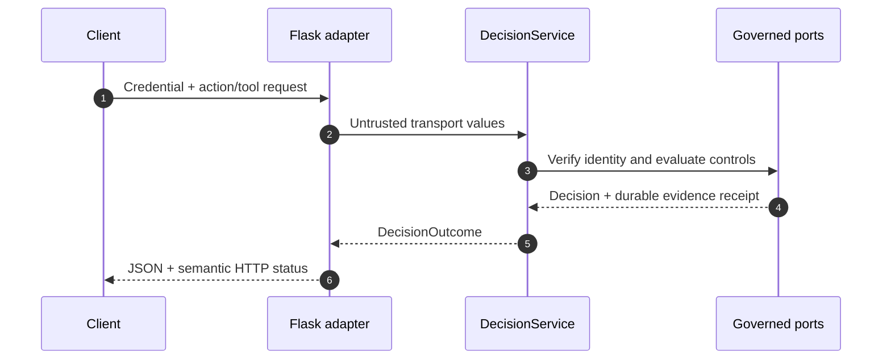

# DecisionService HTTP API (v2)

This is the authoritative HTTP contract for the current GlassBox runtime. The
Flask adapter is implemented in `glassbox/adapters/inbound/http/app.py` and
delegates governance decisions to `glassbox.app.decision_service.DecisionService`.

## Runtime Contract

`create_app(runtime)` requires a complete, already-validated
`GovernanceRuntime`. The HTTP adapter does not construct infrastructure,
evaluate policy, derive risk, or select a tenant. Those responsibilities remain
behind application ports.



## Authentication and Assertions

Live action and tool requests require one of these credential transports:

- `Authorization: Bearer <token>` creates an unverified OIDC credential.
- `X-Client-Cert: <certificate-material>` creates an unverified mTLS credential.

The configured `IdentityVerifier` must verify that material before a principal
exists. Optional `X-Tenant-ID` and `X-Subject-Id` headers are assertions only;
they cannot establish identity. If either contradicts the verified principal,
the request is denied and the spoofing attempt is evidenced.

`POST /v2/replay` accepts a historical principal and action directly. It does
not accept a live credential and is structurally incapable of dispatching an
effect.

## Endpoints

### `GET /healthz`

Returns the validated runtime profile, adapter-set name, and concrete component
types. A successful response means composition completed; it is not a deep
dependency probe.

### `POST /v2/actions/{action_name}`

Evaluates a catalogue-governed action and dispatches only after durable intent
evidence has been written.

```json
{
  "resource": {
    "kind": "purchase_order",
    "id": "po-4471",
    "tenant_id": "acme"
  },
  "parameters": {
    "amount": 750000,
    "category": "semiconductors"
  },
  "idempotency_key": "po-4471-create",
  "causation_id": "workflow-90210"
}
```

`resource`, `resource.kind`, `resource.id`, `resource.tenant_id`, and
`idempotency_key` are required non-empty strings. `parameters` defaults to an
empty object and `causation_id` is optional.

### `POST /v2/tools/{tool_name}`

Validates a tool name and definition digest before resolving its governed
action. The request shape is the action request plus a required digest:

```json
{
  "definition_sha256": "<registered-definition-digest>",
  "resource": {
    "kind": "repository",
    "id": "governance-service",
    "tenant_id": "acme"
  },
  "parameters": {
    "operation": "create_pull_request"
  },
  "idempotency_key": "tool-call-188"
}
```

### `POST /v2/replay`

Re-evaluates historical inputs against the currently wired controls without
calling the dispatcher or overwriting original evidence.

```json
{
  "principal": {
    "agent_ref": "agent.procurement-bot",
    "agent_instance_id": "instance-01",
    "tenant_id": "acme",
    "credential_type": "oidc",
    "credential_id": "credential-42",
    "issued_at": 1760000000,
    "expires_at": 1760003600
  },
  "action": {
    "action": "procurement.create_purchase_order",
    "resource": {
      "kind": "purchase_order",
      "id": "po-4471",
      "tenant_id": "acme"
    },
    "consequence": "irreversible",
    "exposure": {
      "blast_radius": "single",
      "monetary": 750000,
      "records": 1
    },
    "parameters": {
      "amount": 750000
    },
    "idempotency_key": "po-4471-create"
  }
}
```

### `GET /v2/approvals`

Lists every decision currently awaiting human review (a `DecisionEffect.REQUIRE_APPROVAL` outcome). Returns `{"pending": [<approval>, ...]}`, `200`.

### `GET /v2/approvals/{decision_id}`

Returns one decision's current approval status, or `404` with
`{"error_class": "ApprovalNotFoundError", "decision_id": ...}` if none exists.
An approval record shape:

```json
{
  "decision_id": "decision-42",
  "workflow_id": "wf-9",
  "state": "pending",
  "assigned_to": null,
  "escalate_to": null,
  "sla_breached": false,
  "step_count": 0
}
```

### `POST /v2/approvals/{decision_id}/approve`

```json
{ "actor": "reviewer@acme.com", "notes": "verified against PO-4471", "min_approvers": 1 }
```

`actor` is required. `min_approvers` (default `1`) enables dual-control
quorum: the state only advances to `approved` once that many distinct
actors have approved. Returns the updated approval record, `200`.

### `POST /v2/approvals/{decision_id}/reject`

```json
{ "actor": "reviewer@acme.com", "notes": "supplier not cleared" }
```

### `POST /v2/approvals/{decision_id}/escalate`

```json
{ "actor": "reviewer@acme.com", "escalate_to": "senior-reviewer@acme.com", "notes": "needs sign-off" }
```

`actor` and `escalate_to` are both required.

### `POST /v2/approvals/{decision_id}/revoke`

```json
{ "actor": "agent-owner@acme.com", "notes": "underlying mandate revoked" }
```

Withdraws a still-pending approval request before it is reviewed — distinct
from `reject`, which is a reviewer's considered decision.

`ApprovalService` never dispatches an effect; approving a workflow updates
only its own state (`glassbox.app.approval_service.ApprovalService`, backed
by `glassbox.ports.workflow.WorkflowGateway`).

## Response Semantics

Successful parsing returns a `DecisionOutcome` with four top-level fields:

- `decision_id`: stable identifier for the evaluated decision
- `decision`: effect, reasons, risk, obligations, and stage outcomes
- `receipt`: durable intent-evidence location and signer metadata
- `execution`: dispatch, approval, denial, or replay outcome

HTTP status codes are semantic:

| Status | Meaning |
|---|---|
| `200` | Evaluation completed; action executed, did not require dispatch, or was replayed; or an approval query/transition succeeded |
| `202` | Evaluation requires approval; no effect was dispatched |
| `400` | Request shape or domain value is invalid |
| `401` | Credential is absent, invalid, expired, or delegation is invalid |
| `403` | Governance denied the action or tool call |
| `404` | No approval exists for the given `decision_id` |
| `409` | The requested approval transition is not valid from the current state |
| `429` | The in-process HTTP admission-control guard rejected the request before identity verification; `Retry-After` is set |
| `503` | Durable evidence, signing, or the approval workflow gateway was unavailable |
| `500` | An unmapped application error occurred |

Errors use the structured `GlassBoxError.as_dict()` representation. Clients
should branch on the error type or decision effect, not parse human-readable
messages.

## Admission Control

Before identity verification, `HttpAdmissionController` (a per-process,
in-memory sliding-window guard) checks the request against a client-key
budget. This is a cheap first gate against a request burst — it protects one
replica's own CPU/IO cost, not a substitute for the distributed `LimitStore`
that governs verified-identity actions after the pipeline runs. A rejected
request never reaches `DecisionService`.

## Tool-Output Re-Scanning

`POST /v2/tools/{tool_name}` results are re-scanned for prompt injection
after the tool handler runs and before the digest is evidenced. A flagged
result raises `ToolOutputQuarantinedError`: the underlying effect already
ran (authorization was correctly granted), but `execution.status` reports
`FAILED` rather than `EXECUTED`, so the result is never fed forward as
trusted content — and the flagged content itself is never evidenced, only
its digest.

## Production Boundary

The repository provides the Flask application factory, not a complete process
launcher or ingress tier. Production deployments must supply a composed runtime,
a WSGI server, TLS termination, request-size controls, network policy, and
secret management appropriate to the environment. The in-memory adapter set is
development-only and is rejected by the production runtime profile.

## Related Documentation

- [API overview](README.md)
- [Architecture](../ARCHITECTURE.md)
- [Security](../SECURITY/README.md)
- [Verified claims](../CLAIMS.md)