# GlassBox — Architecture Overview

**v1.2.0 | Mohammed Akbar Ansari | Independent Researcher**

> Full component reference: [DEVELOPMENT/architecture.md](DEVELOPMENT/architecture.md)

---

## 1. The Problem & Solution

### Without GlassBox — Ungoverned Gap

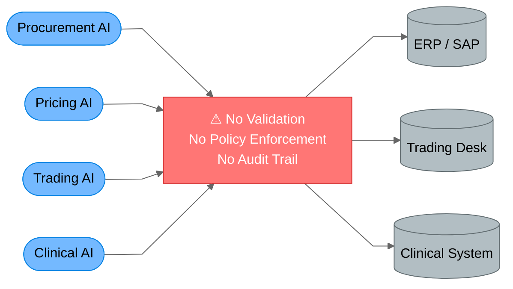

### With GlassBox — Governed Decision Layer

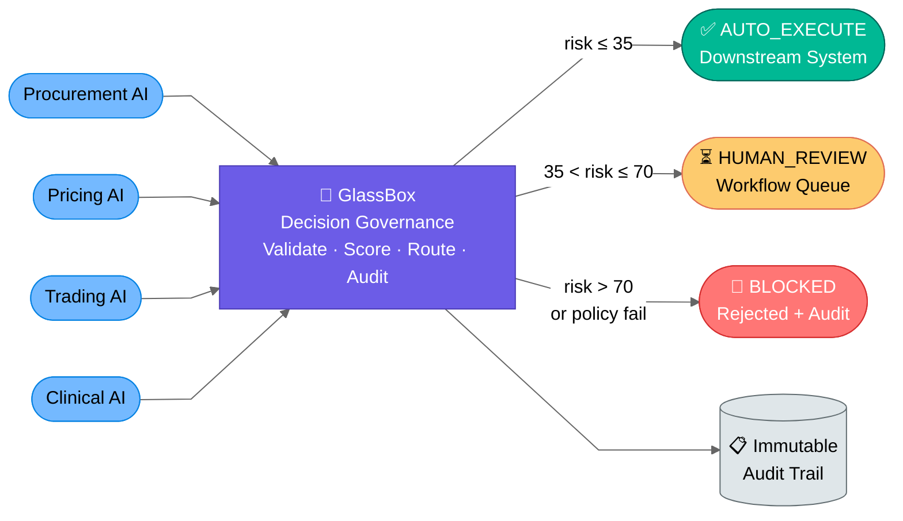

---

## 2. Four-Tier Layer Architecture

```mermaid
%%{init: {'theme': 'neutral', 'flowchart': {'curve': 'linear'}, 'themeVariables': {'fontFamily': 'Arial'}}}%%
flowchart TB
    classDef tier4 fill:#6c5ce7,stroke:#4a3ab5,color:#fff
    classDef tier3 fill:#0984e3,stroke:#044f8c,color:#fff
    classDef tier2 fill:#00b894,stroke:#00695c,color:#fff
    classDef tier1 fill:#fdcb6e,stroke:#e17055,color:#000

    subgraph T4["Tier 4 — Integration Layer"]
        direction LR
        LC[LangChain]:::tier4
        LG[LangGraph]:::tier4
        AG[AutoGen]:::tier4
        CA[CrewAI]:::tier4
        SP["PySpark\\nDatabricks"]:::tier4
        API["REST API\\n17 endpoints"]:::tier4
        MCP[MCP\nGateway]:::tier4
        OPA[OPA\nAdapter]:::tier4
    end

    subgraph T3["Tier 3 — Orchestration & AI Layer"]
        direction LR
        OR[AgentOrchestrator\nChain · DAG · Saga]:::tier3
        RAG[AgenticRAG\nGovernance]:::tier3
        MT[MultiTenant\nPipeline]:::tier3
    end

    subgraph T2["Tier 2 — Application Layer"]
        direction LR
        GP[GovernancePipeline]:::tier2
        WE[WorkflowEngine]:::tier2
        DR[DecisionReplay]:::tier2
        RL[RulesLoader\nYAML/JSON]:::tier2
        PS[PolicySimulator]:::tier2
        EP[Enterprise\nPipeline]:::tier2
    end

    subgraph T1["Tier 1 — Core Framework"]
        direction LR
        PE[PolicyEngine\n35 policies]:::tier1
        RE[RiskEvaluator\n0–100]:::tier1
        AD["AnomalyDetector\\nWelford O(1)"]:::tier1
        VB["VelocityBreaker\\nRate Limits"]:::tier1
        AL[AuditLogger\nLock-Pooled]:::tier1
        TA[TamperEvident\nAudit SHA-256]:::tier1
        WAL[WriteAheadLog\nCrash-Safe]:::tier1
        EB[EventBus\n8 domain events]:::tier1
        AC[AccessControl\nRBAC]:::tier1
        SR[StageRegistry\nP50/P99]:::tier1
    end

    T4 --> T3 --> T2 --> T1
```

---

## 3. The 9-Stage Pipeline (+ 2 Security Pre-checks)

Every `DecisionRequest` passes through these steps. Any step can **block** execution — all later steps are skipped.

| Step | Name | Module | Blocks On |
|---|---|---|---|
| Pre-1 | Security Sanitization | `security/sanitizer.py` | SQL/XSS/SSTI/path-traversal in payload or `agent_id` |
| Pre-2 | Agent-ID Sanitization | `security/sanitizer.py` | Unicode homoglyphs, null bytes |
| 0 | AgentContract Validation | `governance/pipeline.py` | Unauthorised `decision_type`, amount limit exceeded |
| 1 | Context Capture | `governance/context_capture.py` | — enrichment only |
| 2 | Schema Validation | `governance/schema_validator.py` | Missing/wrong-type required fields |
| 3 | Velocity Breaker | `governance/velocity_breaker.py` | Per-agent > 100 req/min; ecosystem limit |
| 4 | Anomaly Detection | `governance/anomaly_detector.py` | Z-score > 3σ after min_samples |
| 5 | Policy Enforcement | `governance/policy_engine.py` | Any registered policy returns `fail` |
| 6 | Risk Evaluation | `governance/risk_evaluator.py` | Composite score → disposition routing |
| 7 | Disposition + Finalise | `governance/pipeline.py` | WAL + audit + EventBus publish |

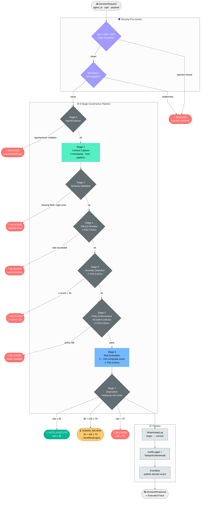

---

## 4. Security Threat Model — What Gets Blocked Where

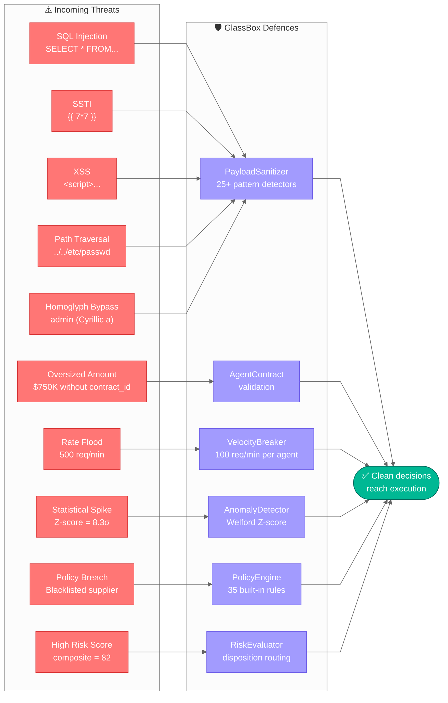

---

## 5. Risk Scoring & Disposition Routing

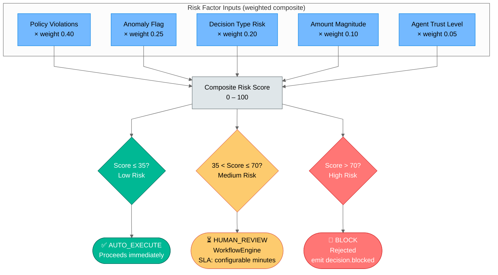

---

## 6. Multi-Tenant Architecture

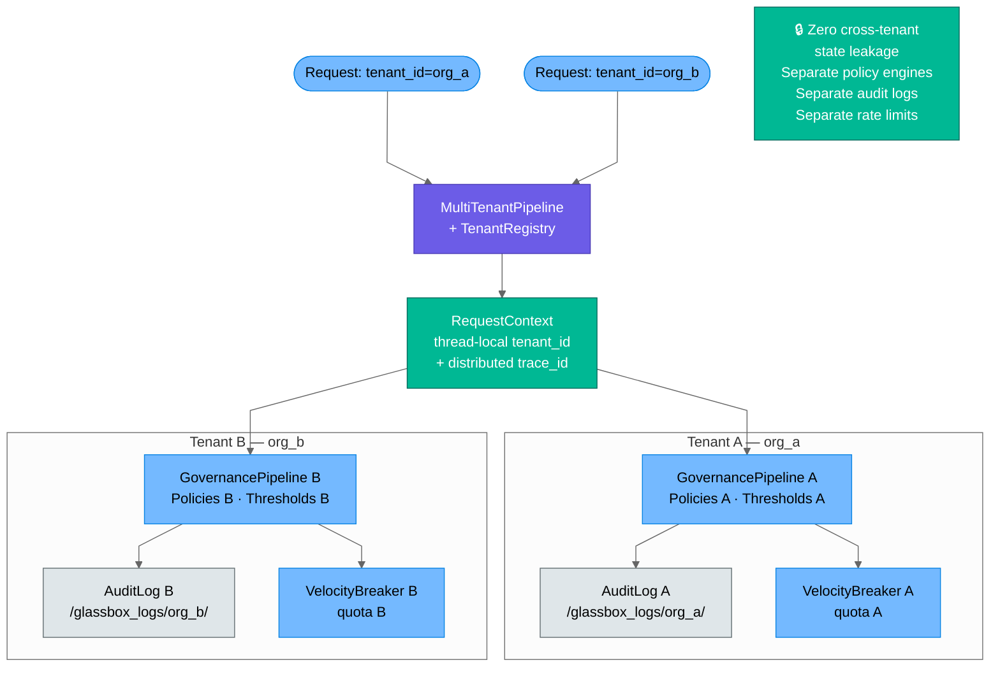

---

## 7. Async Audit Architecture

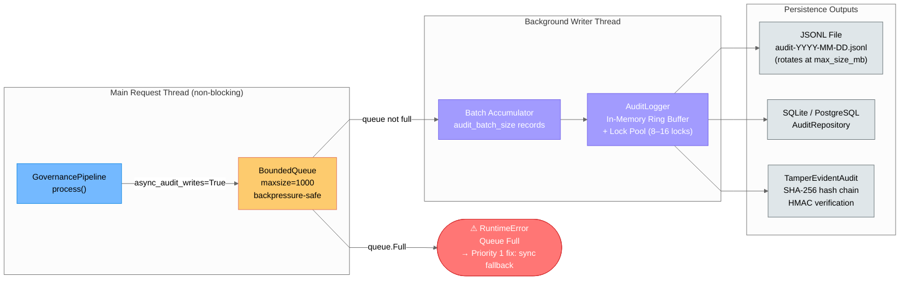

---

## 8. Agent Orchestration Patterns

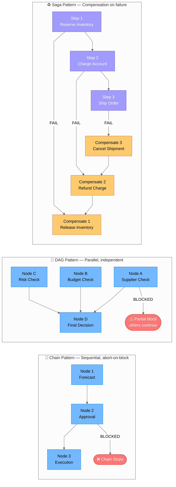

---

## 9. Policy Domain Coverage Map

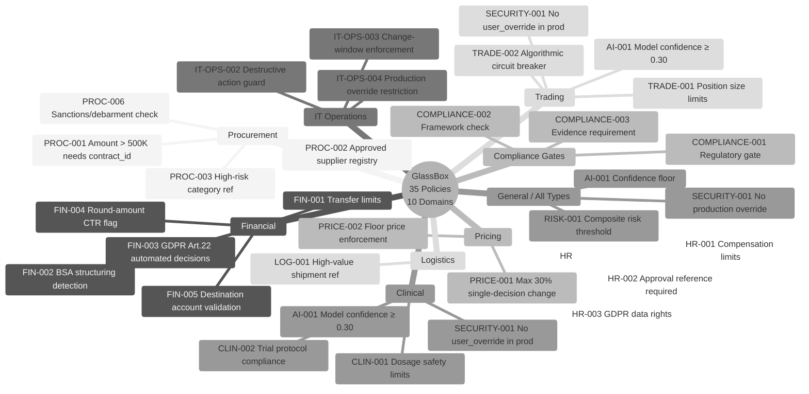

---

## 10. Distributed Deployment (Redis-Backed)

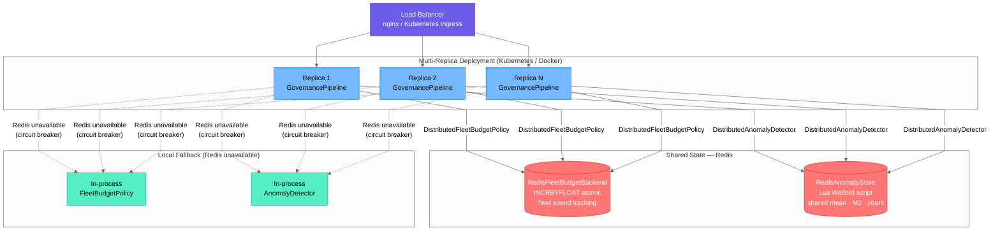

---

## 11. Write-Ahead Log (WAL) — Crash Safety

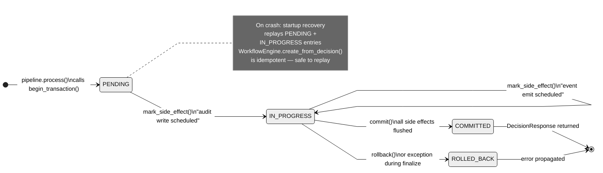

---

## 12. Data Flow — Full Decision Lifecycle

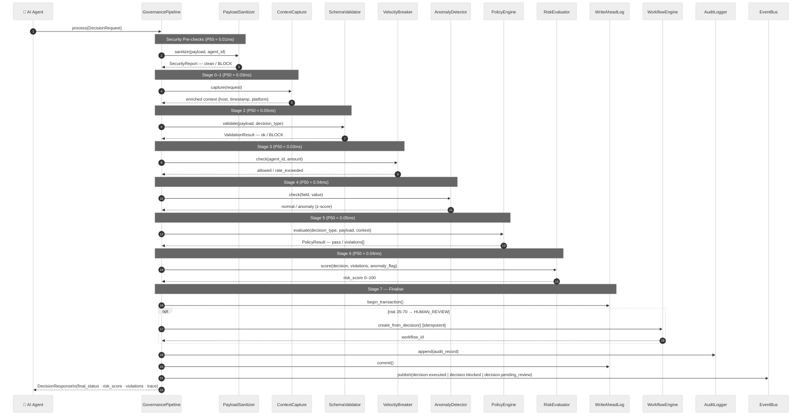

---

## 13. Component Map

```
glassbox/
├── governance/                   Core pipeline domain logic (32 modules)
│   ├── pipeline.py               GovernancePipeline — 9-stage orchestrator
│   ├── models.py                 DecisionRequest, AuditRecord, DecisionResponse, …
│   ├── policy_engine.py          Thread-safe policy registry + evaluator (35 built-in)
│   ├── policy_parameters.py      PolicyParameterStore — runtime threshold updates
│   ├── risk_evaluator.py         Weighted composite scoring 0–100
│   ├── anomaly_detector.py       Welford Z-score; DistributedAnomalyDetector (Redis)
│   ├── velocity_breaker.py       Sliding-window breaker; DistributedFleetBudgetPolicy (Redis)
│   ├── stage_registry.py         StageRegistry — feature flags, P50/P99 per stage
│   ├── write_ahead_log.py        WAL — crash-safe two-phase side-effect tracking
│   ├── advanced_audit.py         TamperEvidentAuditLogger — SHA-256 hash chain
│   ├── audit_logger.py           AuditLogger — lock-pooled ring buffer + JSONL rotation
│   ├── bounded_queue.py          BoundedQueue — backpressure-safe async audit writes
│   ├── event_dispatcher.py       EventDispatcher — fan-out to EventBus handlers
│   ├── schema_validator.py       Payload structure validation per decision type
│   ├── decision_replay.py        Sync + async + parallel batch replay
│   ├── retry_policy.py           RetryExecutor — sync + async retry with backoff
│   ├── context_capture.py        Platform-safe metadata enrichment
│   ├── logging_manager.py        GlassBoxLogger — JSON/text, rotating
│   ├── execution_trace.py        Per-stage timing and outcome trace (opt-in)
│   ├── simulator.py              PolicySimulator — dry-run impact analysis
│   ├── multitenancy.py           TenantRegistry + MultiTenantPipeline
│   ├── access_control.py         RBAC — role hierarchy, permission caching
│   ├── encryption.py             AES-256-GCM field-level encryption + PBKDF2
│   ├── api_gateway.py            Middleware pipeline — auth, rate-limit, CORS
│   ├── request_context.py        Thread-local context — multi-tenant + trace
│   ├── threadpool_config.py      Async worker pool sizing
│   ├── enterprise_pipeline.py    EnterprisePipeline — full-stack production wrapper
│   ├── trust.py                  TrustLevel — agent trust chain validation
│   ├── explainer.py              DecisionExplainer — natural-language rationale
│   ├── currency.py               CurrencyConverter — multi-currency normalisation
│   └── idempotency.py            IdempotencyStore — request deduplication guard
│
├── store/                        Persistence layer
│   ├── database_abstraction.py   DatabaseFactory — SQLite / PostgreSQL / SQL Server
│   └── repository.py             PolicyRepository, AuditRepository, WorkflowRepository
│
├── security/                     Input sanitisation
│   └── sanitizer.py              PayloadSanitizer — 25+ injection pattern detectors
│
├── rules/                        Declarative rules engine
│   ├── rules_engine.py           YAML/JSON → Policy compilation, 13 operators
│   └── hot_reload.py             Live rule updates without restart
│
├── workflow/                     Approval workflow
│   └── workflow_engine.py        pending → in_review → approved/rejected (idempotent)
│
├── events/                       Domain events
│   └── event_bus.py              8 event types, async handlers, webhooks, SSE
│
├── orchestration/                Multi-agent orchestration
│   └── orchestrator.py           Chain, DAG graph, Saga patterns
│
├── rag/                          RAG governance
│   └── governance.py             Query, retrieval, agentic loop governance
│
├── adapters/                     Platform adapters
│   ├── platforms.py              Databricks, Kubernetes, Fabric; auto_detect_adapter()
│   └── spark.py                  GlassBoxSparkAdapter — UDF, mapPartitions, Streaming
│
├── integrations/                 AI framework adapters
│   ├── adapters.py               LangChain, LangGraph, AutoGen
│   ├── extended_adapters.py      CrewAI, AutoGen extended
│   ├── mcp_gateway.py            MCP (Model Context Protocol) gateway
│   └── opa_adapter.py            Open Policy Agent bridge
│
├── compliance/                   Compliance catalogue
│   └── catalogue.py              70 controls across 17 frameworks
│
├── telemetry/                    Observability
│   └── otel_exporter.py          OpenTelemetry trace/span export
│
└── api/                          REST API
    └── app.py                    Flask — 17 endpoints, built-in rate limiting
```

---

## 14. Performance Characteristics

| Metric | Typical | P99 | Notes |
|---|---|---|---|
| Full pipeline latency | 0.10–0.11 ms | 0.18–0.22 ms | In-memory, no I/O |
| With SQLite audit write | < 2 ms | < 5 ms | WAL mode |
| Throughput (single thread) | 5,500 req/s | — | In-memory audit |
| Throughput (SQLite) | 200–600 req/s | — | Disk I/O bound |
| Throughput (10 threads) | 1,500–2,500 req/s | — | Lock-pooled contention |
| Throughput (PostgreSQL, 10 threads) | 5,000–10,000 req/s | — | Parallel writes |

See [DEPLOYMENT/performance_tuning.md](DEPLOYMENT/performance_tuning.md) for full tuning guide.

---

## 15. Thread-Safety Model

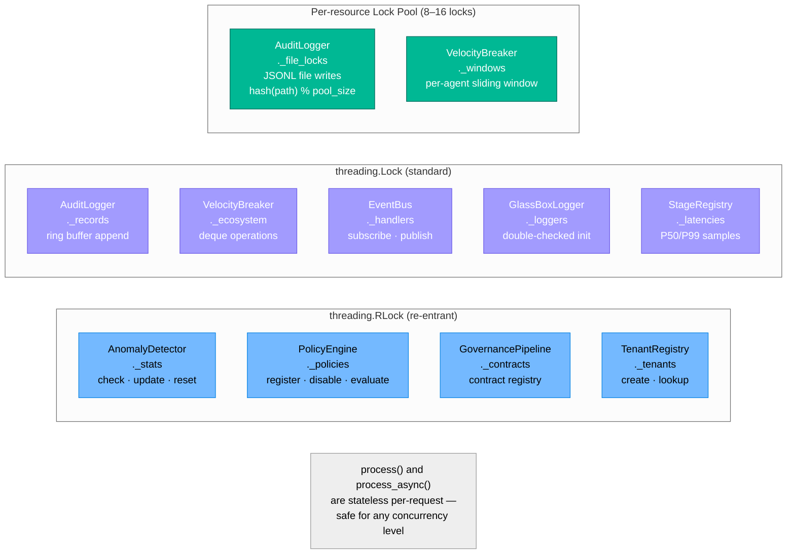

---

## 16. Known Limitations & Open Engineering Items

See [README.md](../README.md#known-limitations--roadmap) for the full prioritised roadmap.

### Priority 1 — Pre-Production

| Item | 
#ll componen
-noqterprise features**: [FEATURES/enterprise.md](FEATURES/enterprise.md)
- **Troubleshooting**: [USER/troubleshooting.md](USER/troubleshooting.md)
- **Glossary**: [GLOSSARY.md](GLOSSARY.md)

---

*GlassBox v1.2.0 · Apache 2.0 · Mohammed Akbar Ansari*


