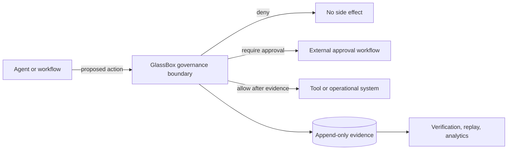
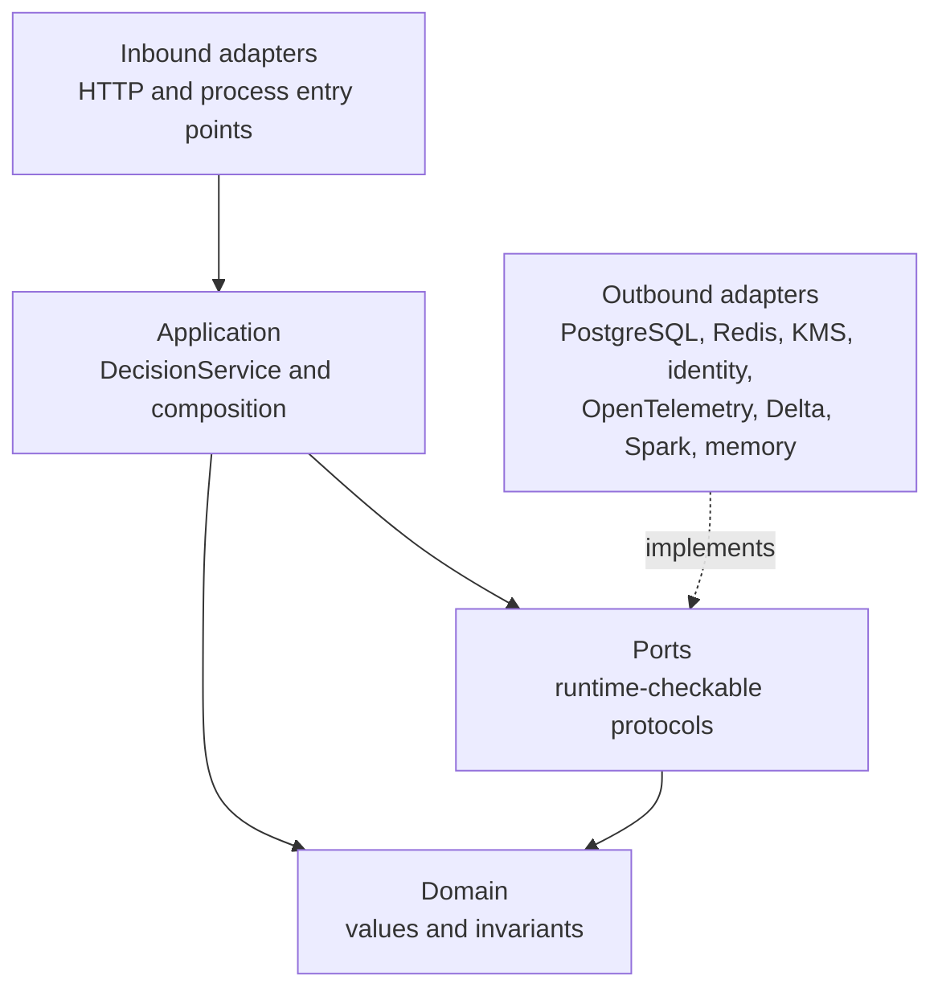
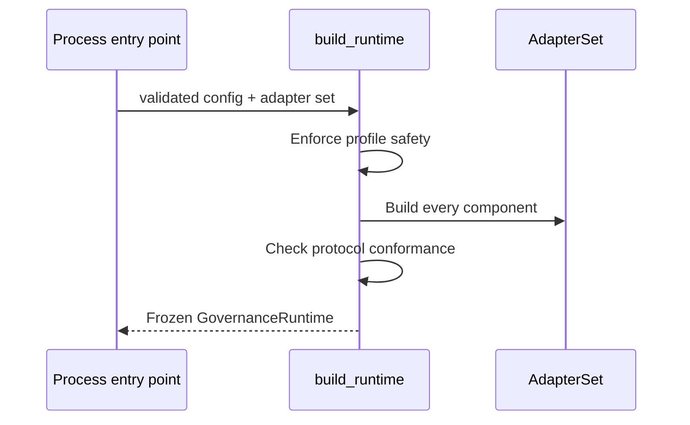
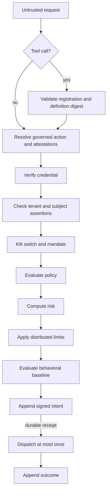
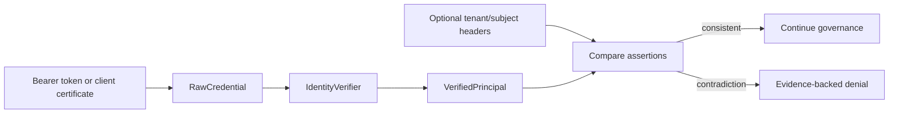
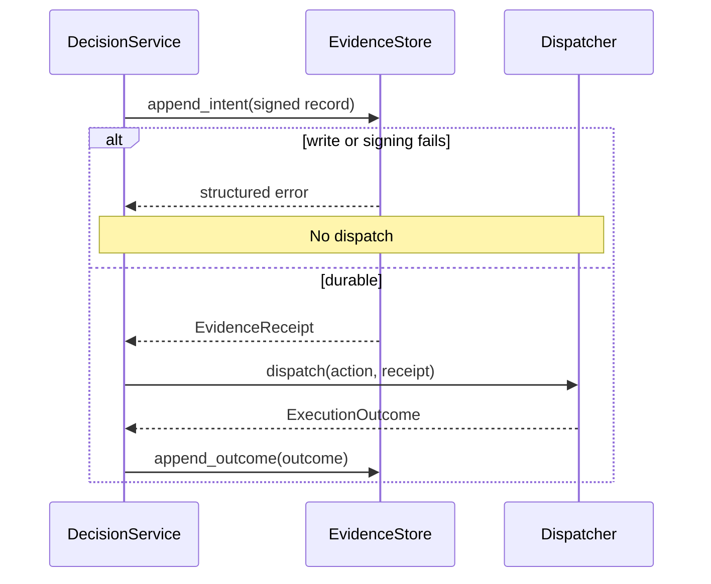

# GlassBox Architecture

GlassBox is a runtime decision-governance boundary for autonomous AI systems.
It evaluates a proposed effect before execution, records durable intent
evidence, and dispatches only when configured controls permit it.

This document describes the current `DecisionService` architecture. The
original synchronous `GovernancePipeline` remains available for compatibility
and is documented in [DEVELOPMENT/architecture.md](DEVELOPMENT/architecture.md).

## System Context


```mermaid
flowchart LR
    Agent[Agent or workflow] -->|proposed action| GB[GlassBox governance boundary]
    GB -->|deny| Stop[No side effect]
    GB -->|require approval| Approval[External approval workflow]
    GB -->|allow after evidence| Target[Tool or operational system]
    GB --> Evidence[(Append-only evidence)]
    Evidence --> Assurance[Verification, replay, analytics]
```

An agent framework decides what it wants to do. GlassBox decides whether that
effect is governed, attributable, within mandate, policy-compliant,
proportionate to risk, and within distributed limits.

GlassBox is not an agent planner, model host, identity provider, human approval
product, policy administration service, or complete cloud platform. It consumes
those capabilities through ports or integrates with them at process boundaries.

## Ports and Adapters


```mermaid
flowchart TB
    Inbound[Inbound adapters<br/>HTTP and process entry points]
    App[Application<br/>DecisionService and composition]
    Ports[Ports<br/>runtime-checkable protocols]
    Domain[Domain<br/>values and invariants]
    Outbound[Outbound adapters<br/>PostgreSQL, Redis, KMS, identity,<br/>OpenTelemetry, Delta, Spark, memory]

    Inbound --> App
    App --> Ports
    App --> Domain
    Ports --> Domain
    Outbound -. implements .-> Ports
```

The machine-enforced dependency direction is:

```text
adapters.outbound -> app -> ports -> domain
```

| Layer | Owns | Excludes |
|---|---|---|
| `glassbox/domain` | Actions, identity, decisions, evidence, risk, limits, validation | I/O, environment, third-party packages |
| `glassbox/ports` | Technology-neutral external capability contracts | Vendor selection and infrastructure construction |
| `glassbox/app` | Composition, configuration, decision sequencing, sealing | Concrete adapters and request-specific state |
| `glassbox/adapters/outbound` | Infrastructure implementations | Domain policy and decision semantics |
| `glassbox/adapters/inbound` | Transport translation and serialization | Trust decisions and governance logic |

Import-linter and `tests/test_layering.py` enforce these boundaries. See the
[domain](../glassbox/domain/README.md), [ports](../glassbox/ports/README.md),
[application](../glassbox/app/README.md), and
[adapter](../glassbox/adapters/README.md) references.

## Composition and Startup

`build_runtime(config, adapters)` constructs one frozen `GovernanceRuntime` per
process. It requires fourteen collaborators:

| Concern | Ports |
|---|---|
| Time | `Clock` |
| Identity | `IdentityVerifier` |
| Governed actions | `ActionCatalogue`, `AttestationProvider` |
| Governed tools | `ToolRegistry` |
| Authority | `MandateStore`, `KillSwitch` |
| Decisioning | `PolicyDecisionPoint`, `RiskEngine` |
| Shared state | `LimitStore`, `BaselineStore` |
| Evidence | `MacSigner`, `EvidenceStore` |
| Effects | `Dispatcher` |


```mermaid
sequenceDiagram
    participant Entry as Process entry point
    participant Root as build_runtime
    participant Set as AdapterSet
    Entry->>Root: validated config + adapter set
    Root->>Root: Enforce profile safety
    Root->>Set: Build every component
    Root->>Root: Check protocol conformance
    Root-->>Entry: Frozen GovernanceRuntime
```

The production profile requires external evidence, WORM anchoring, distributed
limits and baselines, managed signing, a signed policy registry, and all safety
switches at strict values. Development-only adapters are rejected before their
factories run.

## Governed Decision Flow


```mermaid
flowchart TD
    Request[Untrusted request] --> Tool{Tool call?}
    Tool -->|yes| Registry[Validate registration and definition digest]
    Tool -->|no| Catalogue
    Registry --> Catalogue[Resolve governed action and attestations]
    Catalogue --> Identity[Verify credential]
    Identity --> Assertions[Check tenant and subject assertions]
    Assertions --> Authority[Kill switch and mandate]
    Authority --> Policy[Evaluate policy]
    Policy --> Risk[Compute risk]
    Risk --> Limits[Apply distributed limits]
    Limits --> Baseline[Evaluate behavioral baseline]
    Baseline --> Intent[Append signed intent]
    Intent -->|durable receipt| Dispatch[Dispatch at most once]
    Dispatch --> Outcome[Append outcome]
```

The order is a safety property:

1. Catalogue and tool registry data are server-governed.
2. Credentials are verified before a principal is trusted.
3. Tenant and subject headers are assertions, never identity sources.
4. Denial skips later state-consuming stages.
5. Risk remains available for evidence after an earlier denial.
6. Dispatch has one call site and requires a durable receipt.
7. Outcome evidence records execution, denial, approval, or failure.

External callers use `decide_and_dispatch_for_request` or
`decide_and_dispatch_for_tool_call`. Trusted server-side code may supply a
validated `ProposedAction` to `decide_and_dispatch`.

## Decision Outcomes

- **Allow:** dispatch follows durable intent evidence.
- **Deny:** no effect is dispatched; reasons and stage outcomes are recorded.
- **Require approval:** no effect is dispatched by the current request; an
  external workflow owns approval completion.

Infrastructure failures follow explicit domain rules. Required production
controls cannot be silently disabled or replaced by permissive local fallback.

## Identity and Tenant Isolation


```mermaid
flowchart LR
    Material[Bearer token or client certificate] --> Raw[RawCredential]
    Raw --> Verify[IdentityVerifier]
    Verify --> Principal[VerifiedPrincipal]
    Assertions[Optional tenant/subject headers] --> Compare[Compare assertions]
    Principal --> Compare
    Compare -->|consistent| Continue[Continue governance]
    Compare -->|contradiction| Deny[Evidence-backed denial]
```

The verified principal carries tenant, agent, instance, credential, and optional
delegating-subject identity. Resource tenant identity must agree. Durable
adapters enforce tenant context again at storage boundaries, including
PostgreSQL row-level security where configured.

## Evidence Before Effect

Intent and outcome are separate append-only records. Canonical serialization,
keyed MACs, sequence chains, signer identity, segment sealing, and Merkle roots
support integrity verification.


```mermaid
sequenceDiagram
    participant Service as DecisionService
    participant Evidence as EvidenceStore
    participant Dispatcher
    Service->>Evidence: append_intent(signed record)
    alt write or signing fails
        Evidence-->>Service: structured error
        Note over Service,Dispatcher: No dispatch
    else durable
        Evidence-->>Service: EvidenceReceipt
        Service->>Dispatcher: dispatch(action, receipt)
        Dispatcher-->>Service: ExecutionOutcome
        Service->>Evidence: append_outcome(outcome)
    end
```

Tamper evidence is not equivalent to immutable storage. Independent key custody,
database permissions, WORM retention, backup, and legal hold are deployment
responsibilities.

## Replay

Replay re-evaluates historical principal and action values against current
controls. It cannot call the dispatcher and writes a new replay result rather
than modifying original evidence. It supports impact analysis, not effect retry.

## State and Scale

`DecisionService` is stateless apart from its immutable runtime. Cross-request
state belongs behind ports:

- PostgreSQL: evidence and durable dispatch ledger
- Redis: atomic limits and behavioral baselines
- KMS: managed signing
- WORM storage: immutable segment anchors
- OpenTelemetry: traces and metrics installed by an outbound adapter
- Delta/Spark: downstream evidence processing and batch controls

The repository includes development memory adapters and local PostgreSQL/Redis/
MinIO services. It does not provide turnkey production infrastructure.

## Current and Legacy Implementations

| Track | Location | Status |
|---|---|---|
| DecisionService v2 | `domain`, `ports`, `app`, `adapters/inbound`, `adapters/outbound` | Current; use for new integrations |
| GovernancePipeline v1 | `governance`, `store`, `api`, and related packages | Compatibility; retained and tested |

The route, identity, storage, and extension contracts are not interchangeable.
Rebuilt layers are mechanically forbidden from importing legacy packages.

## Security Boundaries

A production design must ensure:

- every effectful path passes through GlassBox;
- identity issuers and trust roots are independently governed;
- catalogue, tool, mandate, and policy changes are controlled;
- PostgreSQL, Redis, KMS, WORM, and target systems meet required availability
  and isolation;
- telemetry does not expose credentials or unrestricted parameters;
- approval and incident workflows are authenticated and auditable.

See [security](SECURITY/README.md) and [hardening](SECURITY/hardening.md).

## Verification

```bash
lint-imports
python -m pytest tests/test_layering.py -q
python -m pytest tests/test_decision_service.py tests/test_http_app.py -q
python -m pytest tests/test_claims_coverage.py -q
```

## Related Documentation

- [Documentation index](README.md)
- [Current HTTP API](API/v2_endpoint_reference.md)
- [Deployment](DEPLOYMENT/README.md)
- [Verified claims and limitations](CLAIMS.md)
- [Legacy architecture reference](DEVELOPMENT/architecture.md)