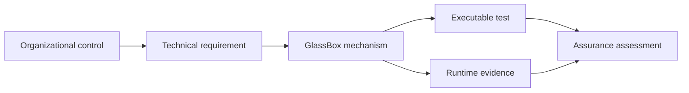

# Compliance Evidence and Control Mapping

GlassBox supplies technical evidence and a catalogue of framework mappings. It
does not make an organization compliant, provide legal advice, issue a
certification, or replace an auditor's assessment.

## Evidence Model

The current runtime can record attributable decision intent and outcome,
including principal, tenant, action, policy/risk results, stage outcomes, model
provenance, receipt, signer identity, and execution status. Segment verification,
Merkle proofs, and WORM anchoring support integrity review when deployed with
independent key custody and retention controls.

## Mapping Status

| Status | Meaning |
|---|---|
| Implemented | A repository mechanism exists; verify cited tests and deployment assumptions |
| Partial | GlassBox contributes evidence, but external controls or missing behavior remain |
| Planned | Design intent only; not available for assurance |
| External | Entirely owned by organization/platform |

The 97-entry [requirements reference](requirements.md) is an engineering
crosswalk maintained by the legacy `ComplianceCatalogue`. Its status values are
not certifications and must be reconciled with the current runtime and the
actual deployment before use in an audit.

## Assessment Workflow

1. Select applicable laws, standards, contracts, and organizational policies
   with qualified legal/compliance owners.
2. Translate each obligation into control objectives and evidence requirements.
3. Map GlassBox mechanisms only where code, tests, and deployed configuration support them.
4. Identify external controls: IAM, approval, encryption, retention, incident
   response, business continuity, model validation, and human oversight.
5. Collect runtime evidence and independent platform evidence.
6. Test control design and operating effectiveness over the required period.
7. Record gaps, owners, remediation, and residual risk.

## High-Value Evidence Questions

- Who or what proposed the action, and how was identity verified?
- Which tenant, resource, action definition, mandate, and policy version applied?
- What risk, limits, baseline, and attestations were evaluated?
- Was intent durable before an effect occurred?
- Was approval required, and which external system completed it?
- Which signing key and evidence segment contain the record?
- Can the segment be independently verified against its immutable anchor?
- Did replay or retry cause any duplicate effect?

## Retention and Data Rights

Retention, legal hold, erasure, data-subject rights, and regulated-record
requirements can conflict with append-only evidence. Resolve these obligations
in the data architecture and policy before deployment. GlassBox provides
seal-before-retention primitives; it does not decide the lawful retention period
or authorize deletion.

## Sources of Truth

- [Verified product claims](../CLAIMS.md)
- [Architecture](../ARCHITECTURE.md)
- [Security model](../SECURITY/README.md)
- [Deployment responsibilities](../DEPLOYMENT/README.md)
- [Framework crosswalk](requirements.md)