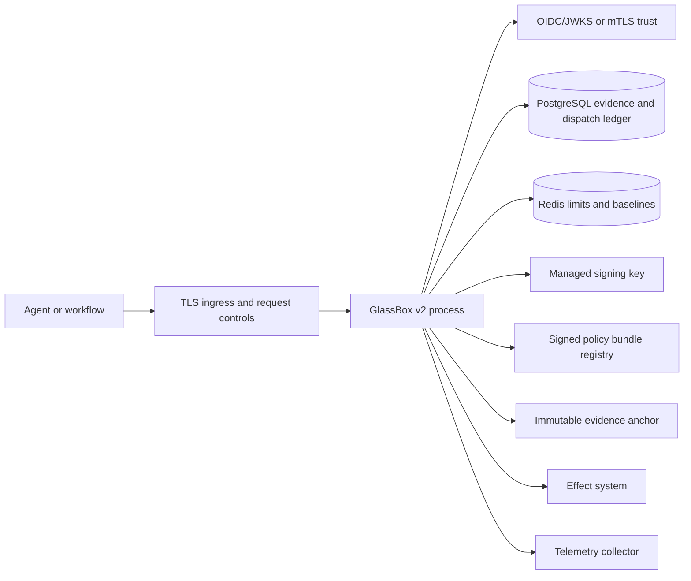

# Deployment and Operations

GlassBox provides a governance library, application composition model, Flask
application factory, infrastructure adapters, and local integration services.
It does not provide a turnkey production platform, cloud account baseline,
Kubernetes manifests, Terraform modules, or a preassembled production
`AdapterSet`.

Production readiness therefore has two parts:

1. the runtime must satisfy GlassBox's enforced configuration and adapter
   contracts;
2. the surrounding platform must satisfy the organization's availability,
   identity, network, key-custody, evidence-retention, and incident controls.

## Documentation Map

- [guide.md](guide.md): staged deployment workflow
- [deployment_reference.md](deployment_reference.md): profiles, settings, and environment variables
- [performance_tuning.md](performance_tuning.md): measurement and scaling guidance
- [../OPERATIONS/README.md](../OPERATIONS/README.md): SLOs and incident runbooks
- [../SECURITY/hardening.md](../SECURITY/hardening.md): production security controls

## Supported Runtime Baseline

- Python 3.13 only, as declared and built in CI
- Linux or Windows for the Python package; production platform qualification is
  operator-owned
- Optional service clients installed from the matching extras
- One validated `GovernanceRuntime` per process

## Assurance Profiles

| Profile | Purpose | Assurance |
|---|---|---|
| `dev` | Local development and deterministic testing | None; unsafe switches and memory adapters may be used |
| `prod` | Enforced production posture | Requires external evidence, WORM anchor, distributed limits/baselines, managed signing, signed policy registry, and safe switches |

The profile has no default. It must be selected explicitly. A development-only
adapter set is rejected by `prod` before factories are called.

## Production Dependency Model



Every effectful path must enter through the governance boundary. A direct path
from an agent to a target system bypasses all GlassBox guarantees.

## Repository-Provided Local Services

`docker-compose.yml` starts PostgreSQL 16, Redis 7, and MinIO for local
integration work:

```bash
docker compose config
docker compose up -d
docker compose ps
```

The credentials are public development defaults. Do not expose this stack or
reuse it in production. MinIO supplies an S3-shaped local endpoint but does not
prove production WORM/Object Lock semantics; local WORM contract tests use the
filesystem adapter.

## Pre-Deployment Gate

- [ ] `RuntimeProfile.PROD` configuration validates with no violations.
- [ ] A complete non-development `AdapterSet` passes protocol and conformance tests.
- [ ] Identity derives tenant and subject from governed trust roots.
- [ ] PostgreSQL schema, row-level security, backups, restore, and retention are verified.
- [ ] Redis persistence/HA and atomic limit behavior are verified across processes.
- [ ] KMS key policy separates use, administration, and audit responsibilities.
- [ ] Policy and catalogue bundles are versioned, signed, activated, and rollback-capable.
- [ ] WORM retention and legal-hold settings are tested on the actual target service.
- [ ] Dispatcher idempotency survives process and replica failure.
- [ ] TLS, request-size, network, and denial-of-service controls exist at ingress.
- [ ] Telemetry redaction, cardinality, sampling, and retention are approved.
- [ ] SLOs, alerts, runbooks, backup restore, and rollback have been exercised.
- [ ] Claims used in risk or compliance material are backed by [CLAIMS.md](../CLAIMS.md).

## Release Validation

```bash
black --check --line-length 100 glassbox tests
isort --check-only --profile black --line-length 100 glassbox tests
lint-imports
ruff check glassbox tests
mypy glassbox --ignore-missing-imports --no-error-summary
python -m pytest tests -q
```

Run environment-backed PostgreSQL and Redis tests against isolated deployment
resources before promotion.

## Known Boundaries

- `/healthz` reports successful composition; it is not a deep dependency probe.
- Approval completion is external to the current v2 HTTP adapter.
- The repository does not assemble a complete production adapter set.
- Infrastructure availability and disaster recovery depend on the deployed
  services, not the Python library alone.
- Compliance mappings are engineering traceability aids, not certification.