# GlassBox — Architecture Reference

**v1.2.0 | Mohammed Akbar Ansari | Independent Researcher |  **

---

## 1. Overview

GlassBox is a **Runtime Decision Governance Framework** for autonomous AI systems.
It implements the *decision-semantic layer* — the missing tier between AI agents and
enterprise execution systems. Every AI-generated operational decision passes through
GlassBox before it reaches any downstream system.

**Formal model:** Every decision `D = (agent, type, context, metadata, payload)` is governed by:

```
G(D) = Φ₈ ∘ Φ₇ ∘ Φ₆ ∘ Φ₅ ∘ Φ₄ ∘ Φ₃ ∘ Φ₂ ∘ Φ₁ ∘ Φ₀(D)
```

where each `Φₙ` is an ordered stage that may `PASS` or `BLOCK` the decision.

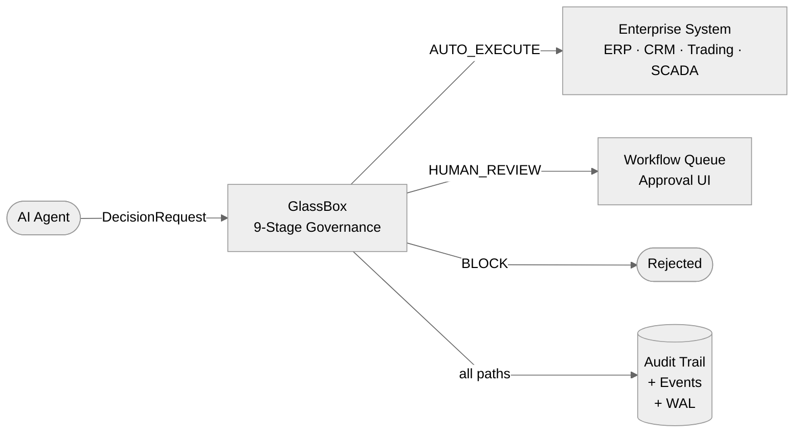

---

## 2. Four-Tier Architecture

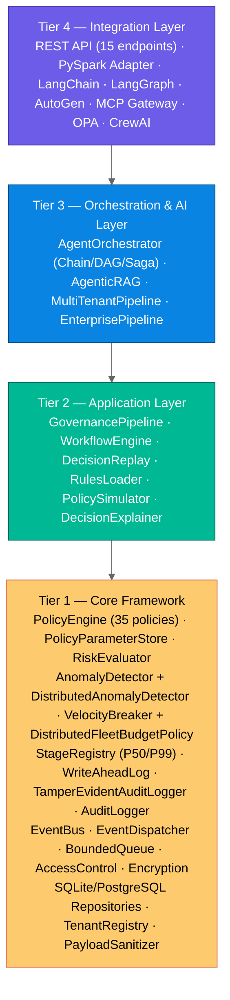

---

## 3. The 9-Stage Pipeline — Detailed

### 3.1 Stage Flow

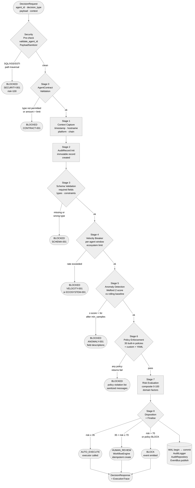

### 3.2 Fail-Fast Semantics

Any stage may emit `BLOCKED`. Subsequent stages are skipped. The audit record is always written, even for blocked decisions. Malicious payloads (security pre-check) are **not** persisted to audit to prevent log injection.

### 3.3 StageRegistry Runtime Contract

`StageRegistry` gates built-in stage execution via feature flags, canary percentages, and cohort rules. It also accumulates per-stage latency samples for P50/P99 computation.

**Important boundary:** custom `stage_impl` objects can be registered but the current pipeline does not dynamically invoke them. The registry controls *whether* built-in stages run, not *what* custom stages run.

---

## 4. Component Architecture

### 4.1 Core Component Dependencies

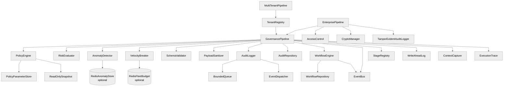

### 4.2 Governance Module Map

```
glassbox/governance/                     32 modules
│
├── PIPELINE CORE
│   ├── pipeline.py           GovernancePipeline — 9-stage orchestrator
│   ├── models.py             All domain models (DecisionRequest, AuditRecord, …)
│   ├── execution_trace.py    Per-stage timer + outcome (opt-in)
│   └── stage_registry.py     Feature flags, canary, P50/P99 latency tracking
│
├── POLICY LAYER
│   ├── policy_engine.py      Thread-safe registry + evaluator
│   │                         ReadOnlySnapshot prevents mutation during eval
│   │                         Lock pooling (16 partitions) for audit writes
│   ├── policy_parameters.py  PolicyParameterStore — runtime threshold updates
│   └── simulator.py          PolicySimulator — dry-run impact analysis
│
├── RISK & ANOMALY
│   ├── risk_evaluator.py     Weighted composite 0-100 with domain extractors
│   ├── anomaly_detector.py   AnomalyDetectorOptimized (Welford O(1))
│   │                         DistributedAnomalyDetector — Redis Lua shared stats
│   └── velocity_breaker.py   Per-agent sliding window + ecosystem limit
│                             DistributedFleetBudgetPolicy — Redis INCRBYFLOAT
│
├── AUDIT LAYER
│   ├── audit_logger.py       AuditLogger — deque ring buffer + JSONL rotation
│   │                         Lock pool (16 partitions) for parallel writes
│   ├── advanced_audit.py     TamperEvidentAuditLogger — HMAC/SHA-256 chain
│   ├── bounded_queue.py      BoundedQueue — backpressure-safe async audit writes
│   └── write_ahead_log.py    WriteAheadLog — PENDING→COMMITTED two-phase tracking
│
├── EVENT LAYER
│   ├── event_dispatcher.py   EventDispatcher — fan-out to handlers
│   └── logging_manager.py    GlassBoxLogger — JSON/text, GLASSBOX_LOG_LEVEL
│
├── INPUT VALIDATION
│   ├── schema_validator.py   Per-type required fields and type checks
│   └── context_capture.py   Platform-safe metadata (hostname, env, chain)
│
├── WORKFLOW
│   └── [workflow_engine.py is in glassbox/workflow/, not governance/]
│       Idempotent create_from_decision() — WAL replay safe
│
├── MULTI-TENANCY & SECURITY
│   ├── multitenancy.py       TenantRegistry — quota, eviction, path-safe IDs
│   │                         MultiTenantPipeline — per-tenant isolated components
│   ├── access_control.py     RBAC — role hierarchy, permission caching
│   ├── encryption.py         AES-256-GCM + PBKDF2 + HMAC
│   ├── api_gateway.py        Middleware — auth, rate-limit, CORS, validation
│   └── request_context.py    Thread-local tenant/trace context
│
├── RETRY & REPLAY
│   ├── decision_replay.py    Sync + async + parallel batch replay
│   └── retry_policy.py       RetryExecutor — sync/async with backoff
│
├── AI FEATURES
│   ├── trust.py              TrustLevel — agent trust chain scoring
│   ├── explainer.py          DecisionExplainer — NL rationale generation
│   └── currency.py           CurrencyConverter — multi-currency normalisation
│
└── INFRASTRUCTURE
    ├── threadpool_config.py  ThreadPoolConfig — async worker pool
    ├── idempotency.py        IdempotencyStore — request deduplication
    └── enterprise_pipeline.py  EnterprisePipeline — full-stack wrapper
```

---

## 5. Storage Architecture — Repository Pattern

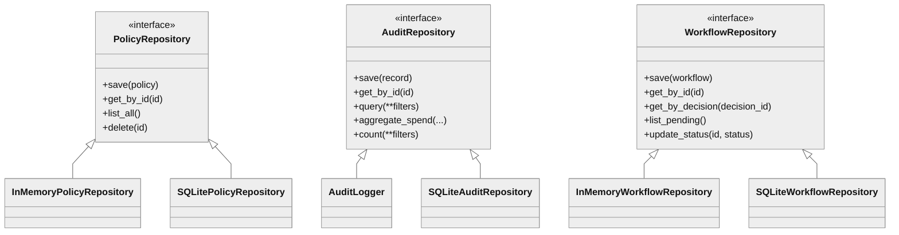

**Adding a PostgreSQL backend:**

```python
class PostgreSQLAuditRepository(AuditRepository):
    def save(self, record): ...
    def get_by_id(self, id): ...
    def query(self, **filters): ...
    def aggregate_spend(self, ...): ...
    def count(self, **filters): ...

pipeline = GovernancePipeline(audit_repo=PostgreSQLAuditRepository(...))
```

### 5.1 Two WAL Systems (Do Not Confuse)

| WAL | Location | Purpose |
|---|---|---|
| SQLite journal WAL mode | `store/database_abstraction.py` | Improves SQLite read/write concurrency |
| Governance WAL | `governance/write_ahead_log.py` | Crash-safe two-phase side-effect tracking |

The governance WAL begins **after** disposition is chosen. It tracks: audit logger write, optional audit repo persist, event emission, and workflow creation. Executor calls and compliance evidence collection are outside the current WAL boundary.

---

## 6. Event-Driven Architecture

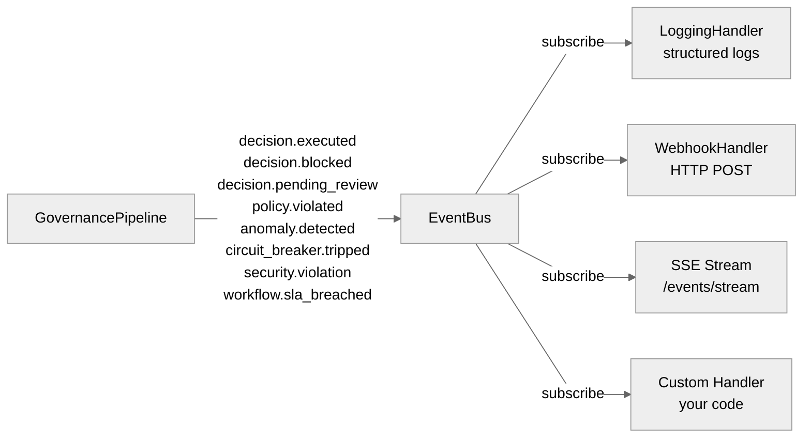

**Integration example:**

```python
from glassbox.events.event_bus import EventBus

bus = EventBus()
bus.subscribe("decision.blocked",
    lambda e: send_slack_alert(e.payload["agent_id"], e.payload["violations"]))
bus.subscribe("*", WebhookEventHandler("https://my-siem.company.com/glassbox"))

pipeline = GovernancePipeline(event_bus=bus)
```

---

## 7. Multi-Tenancy Architecture

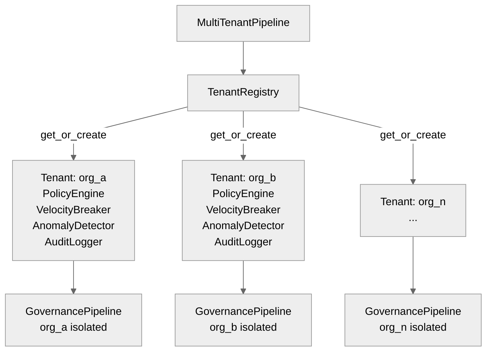

**Tenant ID validation:** alphanumeric + hyphens, 3–128 chars, no path separators, no null bytes, no `../` traversal patterns.

**Quota enforcement:** `max_tenants` cap with LRU eviction of inactive tenants.

---

## 8. Distributed Components (v1.2.0)

### 8.1 Fleet Budget — Redis-backed

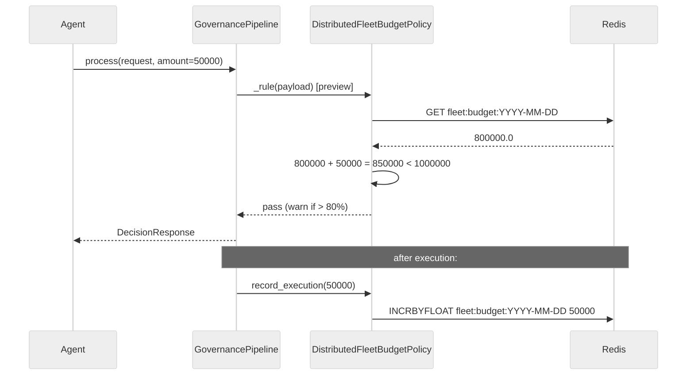

### 8.2 Anomaly Baselines — Redis Welford

The `RedisAnomalyStore` uses an atomic Lua script to update Welford running statistics (`count`, `mean`, `M2`) per `{namespace}:{agent_id}:{decision_type}:{field}` key:

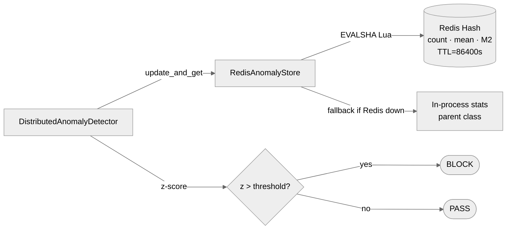

**Exponential forgetting** when `count >= maxn`: `mean = mean*(1-α) + x*α` where `α = 1/maxn`. This keeps the algorithm O(1) in Redis space without storing individual values.

---

## 9. Workflow Engine — State Machine

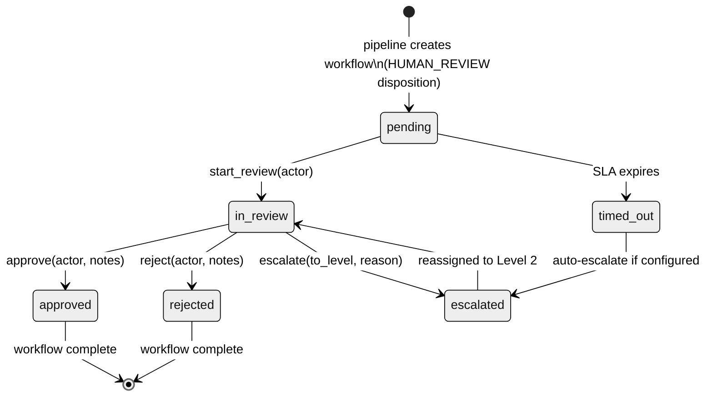

**Idempotency (v1.2.0):** `create_from_decision(decision_id)` checks `repo.get_by_decision(decision_id)` before creating. Duplicate calls (e.g., from WAL replay) return the existing `WorkflowInstance`.

---

## 10. Async Architecture

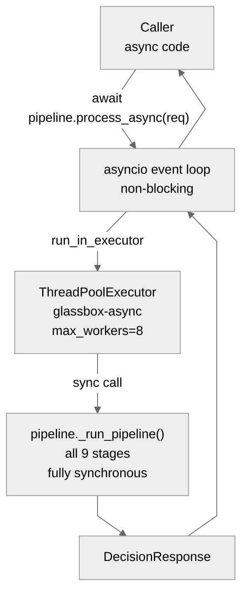

- The asyncio event loop is never blocked
- All existing synchronous code works unchanged in async contexts
- `RetryExecutor.async_execute()` uses `asyncio.sleep()` (not `time.sleep()`)
- `DecisionReplay.async_replay_many()` uses `asyncio.Semaphore` for concurrency cap

---

## 11. Security Model

```mermaid
%%{init: {'theme': 'neutral', 'flowchart': {'curve': 'linear'}, 'themeVariables': {'fontFamily': 'Arial'}}}%%
flowchart TD
    REQ([Incoming Request]) --> V1

    V1{1. agent_id\nvalidation\n^[a-zA-Z0-9_\\-.@:]+$\nmax 128 chars}
    V1 -->|path traversal\nSQL characters\nscript chars| BLK1([BLOCKED\nno audit record])
    V1 -->|ok| V2

    V2{2. PayloadSanitizer\n25+ injection patterns}
    V2 -->|"SQL injection\nXSS / SSTI\npath traversal\nnull bytes\n64KB limit"| BLK2([BLOCKED\nmalicious payload\nNOT logged])
    V2 -->|ok| V3

    V3{3. AgentContract\nStage 0}
    V3 -->|"type not permitted\namount > limit\ndepth > max"| BLK3([BLOCKED\nCONTRACT-001])
    V3 -->|ok| PIPELINE[Stages 1–8\nGovernance Pipeline]

    PIPELINE --> EXCEPT[Exception Sanitization]
    EXCEPT -->|"internal stack traces\nnever reach caller"| SAFE[Sanitized error message\nfull detail in audit log only]
```

**Exception sanitization (v1.2.0 — O5):** When a policy rule raises an exception, the caller receives `"Policy evaluation error (see audit log for details)"`. The full stack trace is written to the structured audit log only.

---

## 12. Thread-Safety Model

Every mutable shared state in GlassBox is protected:

| Component | Lock type | Scope |
|---|---|---|
| `AnomalyDetector._stats` | `threading.RLock` | All reads and writes |
| `PolicyEngine._policies` | `threading.RLock` | register, disable, evaluate |
| `AuditLogger._records` | `threading.Lock` + pool | append, snapshot |
| `AuditLogger._file_locks` | per-path `threading.Lock` | JSONL file writes |
| `VelocityBreaker._windows` | per-agent `threading.Lock` | sliding window |
| `VelocityBreaker._ecosystem` | `threading.Lock` | ecosystem deque |
| `GovernancePipeline._contracts` | `threading.RLock` | contract registry |
| `GovernancePipeline._stage_latency_lock` | `threading.Lock` | P50/P99 sample buffer |
| `GlassBoxLogger._loggers` | `threading.Lock` | double-checked locking |
| `SQLite repositories` | `threading.Lock` | all DB operations |
| `EventBus._handlers` | `threading.Lock` | subscribe, publish |
| `TenantRegistry._tenants` | `threading.RLock` | create, lookup, evict |
| `StageRegistry._stats_lock` | `threading.Lock` | stage stats + latencies |

`process()` is stateless per-request — callable from any number of concurrent threads.

**Lock pooling:** `AuditLogger` uses 16 hash-partitioned `RLock` instances, reducing lock contention by ~16× under concurrent audit writes.

**WeakSet atexit pattern:** A single module-level `atexit` handler (using `WeakSet`) prevents per-instance handler accumulation under high instantiation rates.

---

## 13. Platform Deployment Patterns

### Standard VM / Docker

```python
pipeline = GovernancePipeline(
    log_dir="/var/log/glassbox",
    environment="production",
    recover_wal_on_startup=True,
)
```

### Kubernetes

```python
from glassbox.adapters.platforms import KubernetesAdapter
adapter  = KubernetesAdapter()
pipeline = adapter.create_pipeline()

app.get("/ready",  adapter.readiness_check(pipeline))
app.get("/alive",  adapter.liveness_check())
```

### Databricks / Microsoft Fabric (PySpark)

```python
from glassbox.adapters.spark import GlassBoxSparkAdapter
adapter = GlassBoxSparkAdapter(spark)

result_df = adapter.govern_dataframe(decisions_df)
query = adapter.govern_stream(
    stream_df, output_path="/dbfs/governed", checkpoint="/dbfs/ckpt")
```

### Full Production Stack

```python
from glassbox.store.database_abstraction import DatabaseFactory
from glassbox.events.event_bus           import EventBus, LoggingEventHandler
from glassbox.workflow.workflow_engine   import WorkflowEngine
from glassbox.rules.rules_engine         import RulesLoader
from glassbox.governance.velocity_breaker import DistributedFleetBudgetPolicy
from glassbox.governance.anomaly_detector import DistributedAnomalyDetector, RedisAnomalyStore
import redis

repos     = DatabaseFactory.create("sqlite", db_path="/var/lib/glassbox/glassbox.db")
bus       = EventBus()
bus.subscribe("*", LoggingEventHandler().handle)
wf_engine = WorkflowEngine(repository=repos.workflow_repo(), event_bus=bus,
                            monitor_sla=True, default_sla_minutes=60)

# Optional: Redis-backed distributed components
redis_client = redis.Redis(host="redis", port=6379, decode_responses=True)
fleet_policy  = DistributedFleetBudgetPolicy(budget=1_000_000, redis_client=redis_client)
dist_detector = DistributedAnomalyDetector(
    store=RedisAnomalyStore(redis_client=redis_client, namespace="prod"))

pipeline = GovernancePipeline(
    event_bus=bus,
    audit_repo=repos.audit_repo(),
    workflow_engine=wf_engine,
    anomaly_detector=dist_detector,
    trace_enabled=True,
    recover_wal_on_startup=True,
)
pipeline.policy_engine.register(fleet_policy.as_policy())

RulesLoader().load_and_register("rules/", pipeline.policy_engine, is_directory=True)
```

---

## 14. Data Flow Timeline

```
t=0.000 ms  AI Agent submits DecisionRequest
t=0.005     Security pre-check (agent_id + PayloadSanitizer)
t=0.010     AgentContract checked (permitted types, amounts, depth)
t=0.020     Context captured (timestamp, hostname, platform)
t=0.030     AuditRecord initialised
t=0.040     Schema validated
t=0.060     Velocity window checked (per-agent + ecosystem)
t=0.090     Anomaly detection Z-score computed (Welford O(1))
t=0.140     All applicable policies evaluated (sanitized exceptions)
t=0.170     Risk score computed (0–100 composite)
t=0.185     Disposition determined (execute/review/block)
t=0.190     WAL begin_transaction()
t=0.200     AuditLogger.append() — in-memory ring buffer
t=0.210     AuditRepository.save() — SQLite (if configured)
t=0.215     WorkflowEngine.create_from_decision() — idempotent
t=0.220     WAL commit()
t=0.225     EventBus.publish() — async, non-blocking
t=0.230     DecisionResponse returned to caller
```

P50 = 0.11 ms · P99 = 0.47 ms (single-thread, in-memory, no DB)

---

## 15. Built-In Policies (35 total)

| Policy ID | Domain | Rule |
|---|---|---|
| PROC-001 | Procurement | Amount >$500K requires `contract_id` |
| PROC-002 | Procurement | Supplier must be on approved registry |
| PROC-003 | Procurement | High-risk categories require `approval_ref` |
| PROC-004 | Procurement | Duplicate order detection |
| PROC-005 | Procurement | Sole-source justification required |
| PROC-006 | Procurement | Sanctions / debarment check (runtime-configurable lists) |
| PRICE-001 | Pricing | Max 30% single-decision price change |
| PRICE-002 | Pricing | New price must not go below floor |
| PRICE-003 | Pricing | Price change requires `approval_ref` above threshold |
| PRICE-004 | Pricing | Algorithmic pricing circuit breaker |
| FIN-001 | Financial | Single transfer limit $1M |
| FIN-002 | Financial | Destination account must be on approved list |
| FIN-003 | Financial | GDPR Art.22 — automated decision gate |
| FIN-004 | Financial | BSA structuring detection (round amounts near $10K CTR) |
| FIN-005 | Financial | Cumulative daily transfer limit |
| IT-OPS-002 | IT Ops | Destructive actions require `change_window_approved` |
| IT-OPS-003 | IT Ops | Production changes require `ticket_id` |
| IT-OPS-004 | IT Ops | Off-hours production access blocked |
| LOG-001 | Logistics | High-value shipments require `approval_ref` |
| HR-001 | HR | Compensation decisions >$50K require `approval_ref` |
| HR-002 | HR | Terminations require HR manager sign-off |
| HR-003 | HR | GDPR data rights — personal data access gate |
| CLIN-001 | Clinical | Dosage must not exceed safety threshold |
| CLIN-002 | Clinical | Clinical trial protocol compliance gate |
| TRADE-001 | Trading | Position size limit enforcement |
| TRADE-002 | Trading | Algorithmic trading circuit breaker |
| COMPLIANCE-001 | All | Regulatory compliance gate (configurable) |
| COMPLIANCE-002 | All | Data residency compliance |
| COMPLIANCE-003 | All | Consent verification gate |
| RISK-001 | All | Composite risk threshold enforcement |
| POL-001 | All | Organizational policy gate |
| GEN-001 | All | Generic amount threshold gate |
| GEN-002 | All | Generic approval reference gate |
| AI-001 | All (incl. Clinical, Trading) | Model confidence must be ≥ 0.30 |
| SECURITY-001 | All (incl. Clinical, Trading) | No `user_override` in production |

> **v1.2.0 change (O7):** `SECURITY-001` and `AI-001` now enforce on `CLINICAL` and `TRADING` decision types.
> **v1.2.0 change (O6):** `PROC-006` sanctions/debarment lists are runtime-configurable via `PolicyParameterStore`.
> **v1.2.0 change (O5):** All policy exception messages are sanitized — no internal stack traces reach callers.

---

## 16. Configuration Parameters & Tuning

| Parameter | Component | Default | Notes |
|---|---|---|---|
| `anomaly_min_samples` | AnomalyDetector | 10 | Lower = faster activation |
| `anomaly_z_threshold` | AnomalyDetector | 3.0 | Tighter = fewer anomalies |
| `velocity_window_seconds` | VelocityBreaker | 60 | Per-agent window |
| `max_decisions_per_window` | VelocityBreaker | 100 | Per-agent limit |
| `ecosystem_max_decisions` | VelocityBreaker | 10K | Fleet-wide aggregate |
| `risk_threshold_execute` | RiskEvaluator | 35 | Scores ≤ this auto-execute |
| `risk_threshold_review` | RiskEvaluator | 70 | Scores above this BLOCK |
| `async_audit_writes` | AuditLogger | True | False = sync (safer) |
| `trace_enabled` | ExecutionTrace | False | Enable for debugging |
| `recover_wal_on_startup` | GovernancePipeline | False | Enable for crash safety |
| `max_tenants` | TenantRegistry | 100 | Max concurrent tenants |
| `default_sla_minutes` | WorkflowEngine | 120 | Human review deadline |
| `_LATENCY_WINDOW` | StageRegistry | 1000 | Samples per stage |

---

## 17. Extension Points

| Extension point | How |
|---|---|
| Custom policy | `engine.register(Policy(..., rule=my_fn))` |
| Declarative rule | YAML/JSON via `RulesLoader` |
| Custom risk factors | Override `RiskEvaluator` with custom extractors |
| Storage backend | Implement `PolicyRepository`, `AuditRepository`, `WorkflowRepository` |
| Event handler | `bus.subscribe("*", my_handler)` |
| Platform adapter | Subclass `BaseAdapter`, override `_log_dir()`, `_env_name()` |
| Pipeline stage | Subclass `GovernancePipeline`, override `_run_pipeline()` |
| Schema | Add entry to `SCHEMAS` dict in `schema_validator.py` |
| Decision type | Add to `DecisionType` enum and schema + risk factor extractor |
| Distributed anomaly | `GovernancePipeline(anomaly_detector=DistributedAnomalyDetector(...))` |
| Distributed budget | `pipeline.policy_engine.register(DistributedFleetBudgetPolicy(...).as_policy())` |
| Runtime parameters | `_param_store.set(policy_id, param_name, value, updated_by=...)` |

---

## See Also

- **[../GLOSSARY.md](../GLOSSARY.md)** — Architectural terms defined
- **[../USER/troubleshooting.md](../USER/troubleshooting.md)** — Common issues
- **[../API/endpoint_reference.md](../API/endpoint_reference.md)** — REST API reference
- **[../DEPLOYMENT.md](../DEPLOYMENT.md)** — Deployment on Databricks, Kubernetes, Fabric
- **Module READMEs** — [governance/](../../glassbox/governance/README.md), [workflow/](../../glassbox/workflow/README.md), [store/](../../glassbox/store/README.md)

---

*GlassBox v1.2.0 · Apache 2.0 · Mohammed Akbar Ansari · Independent Researcher ·  *
*Not affiliated with any employer, vendor, or customer engagement.*


