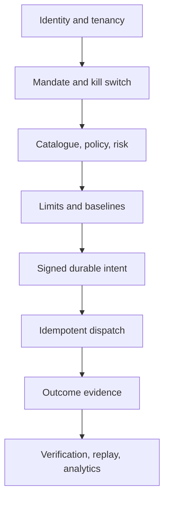

# Enterprise Capability and Maturity Model

GlassBox provides runtime governance primitives for autonomous effects. An
enterprise deployment combines these primitives with governed identity,
infrastructure, policy ownership, approval workflows, and operational controls.

## Capability Map

| Capability | Current implementation | Maturity boundary |
|---|---|---|
| Verified workload identity | `IdentityVerifier`, OIDC/JWKS and mTLS-oriented adapters | Trust roots and lifecycle are operator-owned |
| Tenant isolation | Required domain tenant, assertion checks, PostgreSQL tenant context/RLS | Database roles and policies must be deployed correctly |
| Governed action catalogue | Versioned action definitions, schemas, exposure derivation, attestations | Durable catalogue registry composition is deployment-specific |
| Tool governance | Registration, definition digest, quarantine, mandate grants | Tool inventory ownership is organizational |
| Mandates and kill switch | Time-bounded authority and emergency denial | Approval/revocation process is organizational |
| Policy decision point | Port plus memory reference and bundle domain model | Production signed registry/PDP wiring is deployment-specific |
| Risk scoring | Deterministic risk port and reference engine | Model governance and thresholds are organizational |
| Distributed limits | Redis atomic limit adapter | Redis HA, persistence, and capacity are operator-owned |
| Behavioral baselines | Redis and memory baseline adapters with cold-start prior | Peer-group governance and model monitoring are organizational |
| Evidence-before-effect | Intent receipt required before dispatch | Database durability and KMS availability determine assurance |
| Tamper evidence | Keyed MAC chain, segment sealing, Merkle proofs | Independent key custody and WORM retention are operator-owned |
| Idempotent dispatch | Durable PostgreSQL dispatch ledger | Target system should honor idempotency too |
| Replay | Side-effect-free re-evaluation with new evidence | Historical data access policy is operator-owned |
| Observability | Structured logs and optional OpenTelemetry adapter | Export, redaction, retention, and alerting are operator-owned |
| Data platform processing | Delta Bronze/Silver and Spark batch helpers | Analytical correctness and platform operations are deployment-owned |

## Decision Control Plane

## Multi-Tenant Design

Tenant context is part of the verified principal and resource, not a routing
toggle. Every state key and evidence record is tenant-scoped. Durable adapters
must enforce isolation again at storage boundaries. Operators should use
separate credentials, schemas/databases, or infrastructure where consequence
and regulation require stronger isolation than row-level controls.

## Resilience Posture

Safety dependencies fail closed. Availability planning must account for the
fact that an identity, policy, limit, baseline, evidence, signing, or kill-switch
outage can deny effects. This is deliberate; resilient production architecture
uses redundant dependencies and tested runbooks rather than permissive fallback.

## Governance Operating Model

Assign accountable owners for:

- identity issuers, agent registration, and credential revocation;
- action catalogue, tool definitions, mandates, and policy bundles;
- risk thresholds, baselines, and limit changes;
- approval completion and segregation of duties;
- evidence access, retention, legal hold, key rotation, and verification;
- incident response and emergency kill-switch activation.

## What Is Not Included

The repository does not provide a complete IAM platform, policy administration
service, human approval product, cloud landing zone, secrets manager, SIEM,
Kubernetes/IaC deployment, disaster-recovery system, or certification package.
It provides integration points and verifiable runtime behavior for those systems.

See [CLAIMS.md](../CLAIMS.md) for exact guarantees and known limitations.