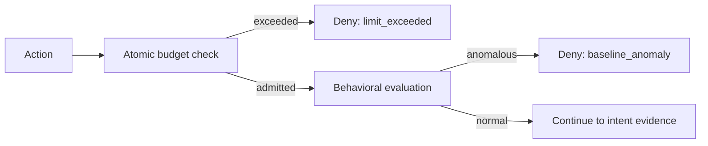

# Distributed Limits and Behavioral Baselines

The current runtime separates deterministic admission limits from behavioral
anomaly detection:

- `LimitStore` applies atomic scoped budgets and cooldowns.
- `BaselineStore` compares observations with subject history or a peer-group
  cold-start prior.

The term **VelocityBreaker** belonged to an earlier synchronous
implementation (`glassbox/governance/velocity_breaker.py`), physically
deleted along with the rest of that implementation. It combined what v2
deliberately keeps as two independently-tunable stores: use the ports above
and their Redis adapters (which also bound one tenant's own subject
footprint via `max_tenant_subjects`, so a burst from one tenant cannot
trigger `maxmemory` eviction of another tenant's keys).

## Why Both Controls Exist

A limit answers: *has this subject consumed more than its governed budget in a
window?* A baseline answers: *is this observation unusual relative to approved
history?* Passing one does not imply passing the other.



## Limit Semantics

Limits are keyed by tenant, scope, subject, metric, and window. Admission uses a
collision-free decision member and performs check-and-consume atomically. A
repeated decision identifier is idempotent. Cooldown state lives in the store.

Production requirements:

- shared Redis state across replicas;
- atomic server-side operations;
- bounded key cardinality and monitored eviction;
- no local permissive fallback on outage;
- consistent tenant/scope/window construction.

## Baseline Semantics

Baselines use bounded sliding samples. If a subject has fewer than the minimum
samples, evaluation uses the configured peer-group key. If neither subject nor
peer history exists, the observation is anomalous rather than silently admitted.

Govern peer membership and baseline initialization as policy data. Monitor
sample count, z-score, threshold, peer-prior usage, and model changes.

## Failure Behavior

For non-advisory effects, an unavailable distributed store results in a
dependency denial. Falling back to process memory would allow each replica its
own budget and reintroduce the bypass this design prevents.

## Operations

Alert on:

- limit and baseline dependency failures;
- sustained limit denials or cooldowns;
- anomalous cold-start volume;
- Redis latency, memory pressure, eviction, replication lag, and failover;
- unexpectedly high subject cardinality;
- divergence in configured windows or thresholds across deployments.

## Verification

```bash
python -m pytest tests/test_redis_limits.py tests/test_redis_baseline.py -q
python -m pytest tests/test_multiprocess_limits.py -q
python -m pytest tests/test_memory_adapters.py -q
```

Redis-backed tests require `GLASSBOX_REDIS_URL`; otherwise they skip.

## Related Documentation

- [Architecture](../ARCHITECTURE.md)
- [Deployment tuning](../DEPLOYMENT/performance_tuning.md)
- [Troubleshooting](../USER/troubleshooting.md)