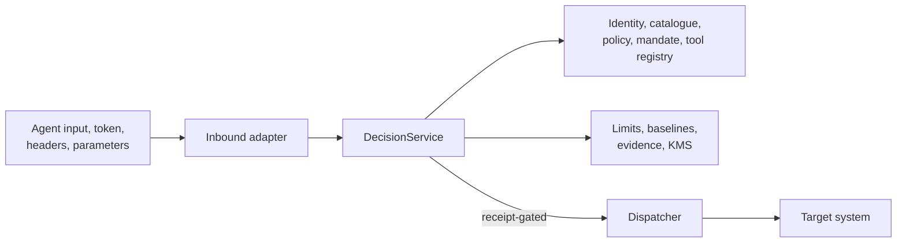

# Security Model

GlassBox is a governance enforcement component, not a complete security
platform. Its guarantees depend on all effectful paths using the component and
on correctly governed identity, storage, key management, policy, and network
services.

## Security Objectives

The current runtime is designed to:

- derive principal and tenant identity from verified credentials;
- prevent callers from selecting their own consequence, exposure, or policy facts;
- deny unknown or modified tools and actions;
- enforce mandate, kill switch, policy, risk, limits, and baselines before effect;
- persist signed intent evidence before dispatch;
- prevent replay from executing effects;
- preserve tenant context and durable idempotency across replicas;
- fail closed when required safety dependencies are unavailable.

Each product guarantee is mapped to code and tests in [CLAIMS.md](../CLAIMS.md).

## Trust Boundaries



Untrusted inputs remain untrusted until the owning control verifies or derives
them. Transport headers may assert tenant or subject values but cannot establish
them.

## Threats and Controls

| Threat | Control |
|---|---|
| Caller lowers action risk | Consequence/exposure derived from governed catalogue |
| Tenant spoofing | Verified principal plus assertion/resource tenant checks |
| Tool rug pull | Registered definition digest and quarantine state |
| Indirect prompt injection via tool output | Tool results re-scanned after dispatch (`prompt_injection.scan()`); flagged results raise `ToolOutputQuarantinedError` and are never fed forward as trusted content |
| Excess authority | Time-bounded mandate and tool grants; resource-scoped grants (`ActionResourceGrant`) narrow authority to a specific resource, not just an action name |
| Burst or distributed bypass | Atomic shared limit store and cooldown, with a per-tenant subject quota (`max_tenant_subjects`) preventing one tenant's burst from evicting another's state |
| HTTP-layer request flood | In-process admission-control guard (`HttpAdmissionController`) rejects a burst before identity verification |
| Cold-start anomaly bypass | Peer-group baseline prior; no silent skip |
| Evidence loss before effect | Durable intent receipt required by dispatcher |
| Evidence forgery | Canonical keyed MAC chain, signer identity, segment verification (intent records only — outcome records are an accepted gap, see CLAIMS.md) |
| Duplicate side effect | Durable idempotency ledger and receipt validation |
| Replay causes effect | Structurally separate replay path with no dispatcher call |
| Dependency outage permits effect | Production safety switches and fail-closed errors |
| Unauthorized dispatch of a high-risk decision | `DecisionEffect.REQUIRE_APPROVAL` + `ApprovalService`; dual-control quorum via `WorkflowEngine.quorum_approve` |
| Risk score silently ignored | Opt-in `RiskConfig.enforce_threshold`/`deny_level` gate (`DenialReason.RISK_THRESHOLD_EXCEEDED`) |

## Responsibility Boundary

GlassBox does not by itself provide TLS termination, DDoS protection, identity
issuance, secrets management, database encryption, KMS administration, SIEM,
approval completion, host hardening, vulnerability response, backup/restore, or
disaster recovery. These are required platform and organizational controls.

## Security Validation

```bash
bandit -r glassbox --skip B101,B311 --severity-level medium --confidence-level medium
python -m pytest tests/test_adversarial_suite.py -q
python -m pytest tests/test_prompt_injection.py tests/test_oidc_identity.py -q
python -m pytest tests/test_sealing.py -q
```

Dependency and secret scanning also run in CI.

## Reporting Vulnerabilities

Do not open a public issue. Use the repository owner's private GitHub Security
Advisory workflow and include impact, affected component, reproduction steps,
and suggested remediation where possible. See [CONTRIBUTING.md](../../CONTRIBUTING.md).

## Related Documentation

- [Production hardening](hardening.md)
- [Architecture boundaries](../ARCHITECTURE.md#security-boundaries)
- [Operations](../OPERATIONS/README.md)
- [Verified claims](../CLAIMS.md)