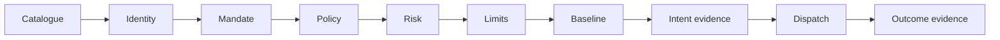

# Quick Start: DecisionService Runtime

This guide uses the current GlassBox architecture: `domain`, `ports`, `app`,
and `adapters`. For the retained synchronous `GovernancePipeline`, use the
[legacy architecture reference](../DEVELOPMENT/architecture.md) and
[legacy API reference](../API/endpoint_reference.md).

## Prerequisites

- Python 3.10 or later
- Git and a virtual environment
- No external service for the development example

## Install

```bash
python -m venv .venv
```

Activate the environment:

```powershell
.venv\Scripts\Activate.ps1
```

```bash
source .venv/bin/activate
```

Install the package and test tools:

```bash
python -m pip install --upgrade pip
pip install -e .[dev]
```

The core package has zero mandatory runtime dependencies. Optional extras add
Flask, PostgreSQL, Redis, KMS, OpenTelemetry, Delta Lake, Spark, YAML,
cryptography, or authoring support.

## Understand the Development Boundary

The example below uses `memory_adapter_set()`. It is intentionally marked
`dev_only` and provides no production assurance:

- state disappears on restart;
- limits and baselines are local to one process;
- the signing key is readable by the process;
- evidence is not independently durable or immutable.

`build_runtime` rejects this adapter set under `RuntimeProfile.PROD`.

## Run a Governed Action

The setup is explicit because GlassBox denies by default: an action needs a
catalogue definition, mandate, policy permission, baseline, and dispatch handler.

```python
from glassbox.adapters.outbound.memory import (
    AllowListPolicyDecisionPoint,
    InMemoryActionCatalogue,
    memory_adapter_set,
    wire_memory_adapter_set,
)
from glassbox.app.composition import build_runtime
from glassbox.app.config import GlassBoxConfig, RuntimeProfile
from glassbox.app.decision_service import DecisionService
from glassbox.domain.action import BlastRadius, ConsequenceClass, Exposure, ResourceRef
from glassbox.domain.catalogue import (
    ActionCatalogueBundle,
    ActionDefinition,
    ExposureRule,
    ParameterField,
    ParameterType,
)
from glassbox.domain.identity import CredentialType, RawCredential
from glassbox.domain.limits import Window
from glassbox.domain.mandate import Mandate
from glassbox.ports.baseline import BaselineKey, BaselineScope

TENANT = "acme"
AGENT = "agent.procurement-bot"
ACTION = "procurement.create_purchase_order"

# 1. Compose and verify a development runtime.
config = GlassBoxConfig(profile=RuntimeProfile.DEV)
runtime = wire_memory_adapter_set(build_runtime(config, memory_adapter_set()))
service = DecisionService(runtime)

# 2. Register the governed action. Consequence and exposure are server-derived.
catalogue = runtime.action_catalogue
assert isinstance(catalogue, InMemoryActionCatalogue)
catalogue.load_bundle(
    ActionCatalogueBundle(
        bundle_id="procurement.catalogue.v1",
        tenant_id=TENANT,
        version=1,
        definitions=(
            ActionDefinition(
                action=ACTION,
                consequence=ConsequenceClass.COMPENSABLE,
                exposure_rule=ExposureRule(
                    blast_radius=BlastRadius.SINGLE,
                    monetary_field="amount",
                ),
                parameter_schema=(
                    ParameterField("amount", ParameterType.NUMBER, required=True),
                    ParameterField("category", ParameterType.STRING, required=True),
                ),
            ),
        ),
    )
)

# 3. Give this agent a bounded, time-valid mandate.
runtime.mandate_store.put(
    Mandate(
        tenant_id=TENANT,
        agent_ref=AGENT,
        version=1,
        max_consequence=ConsequenceClass.IRREVERSIBLE,
        max_exposure=Exposure(monetary=1_000_000),
        valid_from=0,
        allowed_actions=frozenset({"procurement.*"}),
        allowed_resources=frozenset({"purchase_order/*"}),
    )
)

# 4. Permit the action in the development policy adapter.
pdp = runtime.policy_decision_point
assert isinstance(pdp, AllowListPolicyDecisionPoint)
pdp.allow(TENANT, ACTION)

# 5. Seed enough normal history to avoid a cold-start denial.
baseline_key = BaselineKey(
    tenant_id=TENANT,
    scope=BaselineScope.AGENT,
    subject=AGENT,
    metric="exposure_monetary",
    window=Window(30 * 86_400),
)
now = runtime.clock.now()
for index in range(40):
    runtime.baseline_store.observe(
        baseline_key,
        100_000 + ((index % 5) - 2) * 1_000,
        now=now,
    )

# 6. Register the side effect. Production dispatchers use durable idempotency.
runtime.dispatcher.register(
    ACTION,
    lambda action: {"purchase_order_id": action.resource.id, "status": "created"},
)

# 7. Submit an untrusted credential and transactional parameters.
credential = RawCredential(
    credential_type=CredentialType.OIDC,
    material=f"dev:{TENANT}:{AGENT}:instance-01",
    presented_at=runtime.clock.now(),
)

outcome = service.decide_and_dispatch_for_request(
    credential,
    action_name=ACTION,
    resource=ResourceRef(
        kind="purchase_order",
        id="po-4471",
        tenant_id=TENANT,
    ),
    parameters={"amount": 100_000, "category": "semiconductors"},
    idempotency_key="po-4471-create",
)

print(outcome.decision.effect.value)
print(outcome.execution.status.value)
print(outcome.receipt.segment_id, outcome.receipt.seq)
```

Expected result: the decision effect is `allow`, execution is `executed`, and a
development evidence receipt is returned. Reusing the idempotency key must not
repeat the effect.

## What the Service Evaluates



For external requests, catalogue resolution occurs before identity so an
unknown action is never assigned caller-provided consequence or exposure. Tool
calls add registry and definition-digest validation before catalogue resolution.

## Use the HTTP Adapter

Install Flask:

```bash
pip install -e .[api]
```

The repository exposes an application factory, not a default production
process. Pass a composed runtime to `create_app`:

```python
from glassbox.adapters.inbound.http.app import create_app

app = create_app(runtime)
```

Serve that app with the WSGI server and ingress controls selected by your
deployment. The current routes are:

- `GET /healthz`
- `POST /v2/actions/{action_name}`
- `POST /v2/tools/{tool_name}`
- `POST /v2/replay`

See the [v2 endpoint reference](../API/v2_endpoint_reference.md) for request and
response contracts. Do not use `python -m glassbox.api.app` for v2; that module
belongs to the legacy compatibility API.

## Move Toward Production

Production composition must replace every development-only capability and use
`RuntimeProfile.PROD`.

| Concern | Development | Production direction |
|---|---|---|
| Identity | `DevIdentityVerifier` | Governed OIDC/JWKS or mTLS verifier |
| Evidence | Process memory | Durable PostgreSQL evidence store |
| Limits/baselines | Process memory | Atomic Redis adapters |
| Signing | Local readable key | Managed KMS signer |
| Dispatch | In-memory handler | Durable idempotency ledger and effect integration |
| Evidence anchors | None | WORM/object-lock storage |
| Telemetry | No-op or console | Governed OpenTelemetry exporter |

The repository supplies adapter implementations and a local integration stack;
it does not supply turnkey cloud infrastructure. Complete the
[deployment readiness checklist](../DEPLOYMENT/README.md) and
[security hardening guide](../SECURITY/hardening.md) for the target environment.

## Verify the Installation

```bash
python -m pytest tests/test_decision_service.py tests/test_http_app.py -q
python -m pytest tests/test_claims_coverage.py -q
```

## Next Steps

- [Architecture](../ARCHITECTURE.md)
- [Application layer](../../glassbox/app/README.md)
- [Port and adapter development](../DEVELOPMENT/implementation_guide.md)
- [Testing strategy](../DEVELOPMENT/testing.md)
- [Verified claims and limitations](../CLAIMS.md)