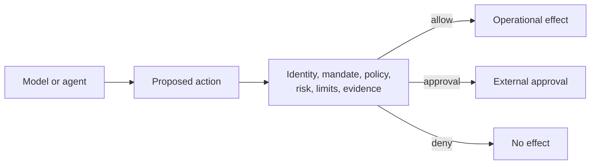

# Enterprise Use Patterns

GlassBox is most useful at the boundary where an AI-generated recommendation
could become an operational effect. The domain changes by industry; the
governance pattern remains stable.

## Procurement and Payments

**Actions:** create purchase order, release payment, modify supplier account.

**Governed data:** monetary exposure, supplier/resource identity, consequence,
required supplier/legal attestations, agent mandate, cumulative limits.

**Controls:** derive amount from transactional parameters, verify supplier state
through an attestation provider, apply per-agent and tenant limits, and require
durable intent evidence before the payment or order API is called.

## IT and Cloud Operations

**Actions:** change firewall rule, rotate credential, deploy release, scale
infrastructure, delete resource.

**Governed data:** environment, resource scope, blast radius, change-window
attestation, tool definition digest, rollback capability.

Use a tool registry so a changed tool schema or description is treated as a new,
unapproved definition. Irreversible/global actions should have stricter mandate,
risk, approval, and limit policies than reversible single-resource changes.

## Software Delivery Agents

**Actions:** create pull request, merge, publish package, modify CI, promote an
artifact.

Pin tool definitions, scope resources to repositories/environments, require
branch-protection or scan attestations from systems of record, and use the
dispatcher ledger to prevent repeated publication under retries.

## Customer Service and Case Management

**Actions:** issue refund, change account state, disclose record, escalate case.

Separate model-generated text from transactional fields. Apply prompt-injection
inspection only to fields declared as untrusted text in the action definition;
do not regex-scan ordinary business names and descriptions indiscriminately.

## Healthcare and Regulated Decisions

**Actions:** route a case, schedule a service, release a recommendation, modify
a record.

GlassBox can enforce identity, mandate, policy, approval, evidence, and limits.
It does not establish clinical validity, regulatory authorization, informed
consent, or organizational compliance. Those controls remain external inputs
and attestations governed by qualified owners.

## Multi-Agent Workflows

Govern each effectful step rather than granting a workflow blanket authority.
Preserve `causation_id` across the chain, verify each acting principal, and give
each agent a mandate limited to its role. A coordinator's authority must not be
implicitly inherited by worker agents.

## MCP and Tool Gateways

Register each tool name and definition digest. At invocation, validate the
presented digest before catalogue resolution. A missing, modified, or
quarantined tool is denied before downstream policy or dispatch.

## Batch and Data Platforms

Preauthorize bounded batches using serializable functions, then retain
per-record evidence and idempotency where effects occur. Delta Bronze/Silver
adapters support evidence analytics; they are downstream of the transactional
decision path and do not replace durable intent persistence.

## Historical Policy Analysis

Use replay to compare historical principal/action inputs against current
mandate, policy, risk, limit, and baseline wiring. Replay records a new result
and cannot call the dispatcher. It is appropriate for impact analysis, not for
retrying failed effects.

## Design Checklist

For each use case, define:

1. exact effectful actions and resources;
2. consequence class and exposure derivation;
3. trusted identity and tenant source;
4. mandate owner and revocation process;
5. policy/catalogue/tool bundle lifecycle;
6. external attestations and their systems of record;
7. distributed limits and baseline peer groups;
8. approval owner and completion workflow;
9. dispatch idempotency and target-system credentials;
10. evidence retention, key custody, WORM anchoring, and incident response.

## Runnable Compatibility Scenarios

The scripts in [examples](../../examples/README.md) demonstrate 18 industry
patterns using the retained v1 API. Treat their policy IDs as examples, not
product claims. New integrations should follow the
[current quick start](quick_start.md).