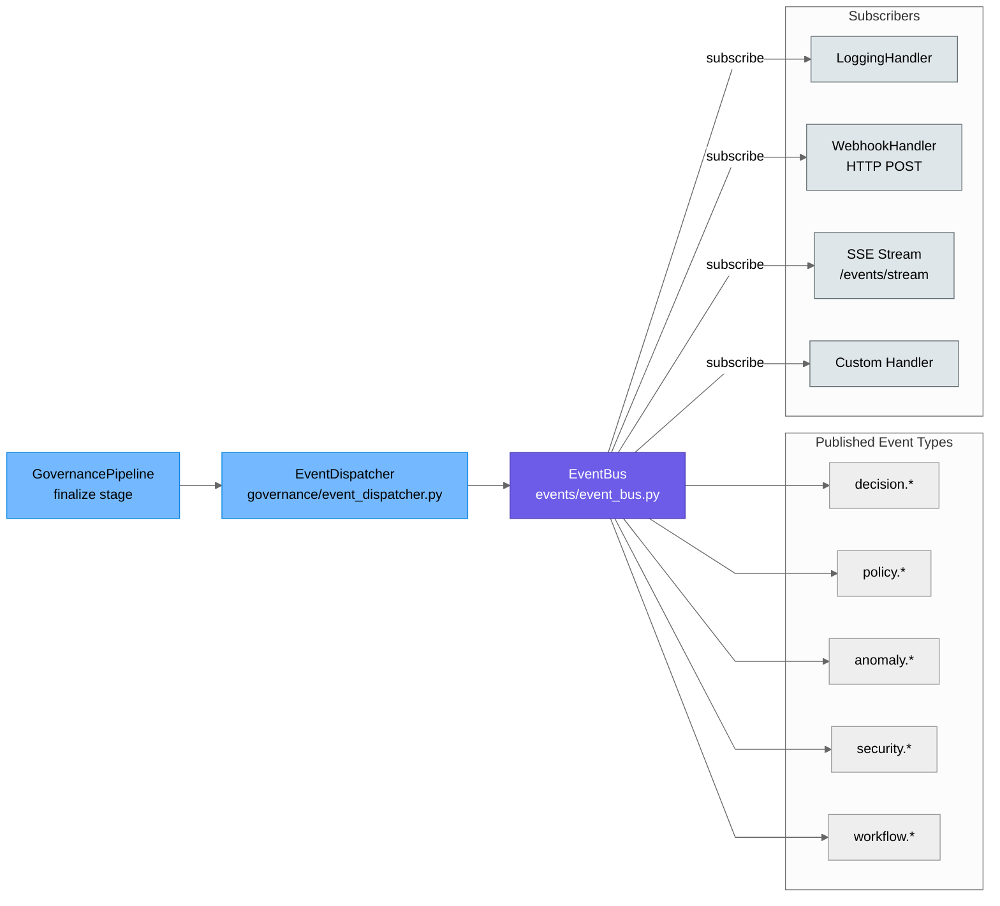

# glassbox/events — Domain Event Bus

The `events` package provides the integration point for external systems.

| Module | Role |
|---|---|
| `event_bus.py` | `EventBus`, 8 domain event factories, async handlers, webhook handler, SSE |

> The `governance/event_dispatcher.py` module handles fan-out from `GovernancePipeline` to `EventBus` handlers — it is the internal bridge between the pipeline finalize path and the external event bus.



**Domain events published:**
- `decision.executed` — decision approved and sent to downstream
- `decision.blocked` — decision blocked with violations
- `decision.pending_review` — decision routed to human review queue
- `policy.violated` — policy violations detected
- `circuit_breaker.tripped` — velocity or anomaly breaker fired
- `anomaly.detected` — statistical anomaly in payload
- `security.violation` — injection or malicious payload detected
- `workflow.sla_breached` — review SLA timer exceeded

---

## Quick Start

```python
from glassbox.events.event_bus import EventBus, WebhookEventHandler

# Initialize bus
bus = EventBus()

# Subscribe to specific event
def on_decision_blocked(event):
    print(f"Decision {event.payload['decision_id']} blocked: {event.payload['violations']}")

bus.subscribe("decision.blocked", on_decision_blocked)

# Subscribe to all events with webhook
bus.subscribe("*", WebhookEventHandler("https://siem.company.com/glassbox"))

# Subscribe to event pattern
bus.subscribe("policy.*", lambda e: log_policy_event(e))

# Emit event (called by governance pipeline)
bus.publish("decision.executed", {
    "decision_id": "DEC-001",
    "agent_id": "agent_foo",
    "timestamp": 1234567890
})
```

---

## Event Handler Patterns

### Pattern 1: Synchronous Alert Handler

```python
def alert_critical_policy_violations(event):
    """Synchronous handler for immediate alerts"""
    violations = event.payload.get('violations', [])
    if 'RESTRICTED_VENDOR' in violations:
        # Send immediate Slack/email alert
        notify_compliance_team(f"Critical: {event.payload['policy_id']} violated")

bus.subscribe("policy.violated", alert_critical_policy_violations)
```

### Pattern 2: Async Logging Handler

```python
import asyncio

async def async_audit_logger(event):
    """Non-blocking async handler for audit trails"""
    # Write to Elasticsearch or external log aggregator
    await elasticsearch_client.index(
        index="governance-audit",
        body=event.payload
    )

bus.subscribe("decision.executed", async_audit_logger, async_handler=True)
```

### Pattern 3: Webhook Handler

```python
from glassbox.events.event_bus import WebhookEventHandler

# Push events to external webhook
handler = WebhookEventHandler(
    url="https://webhook.example.com/glassbox",
    timeout_seconds=5,
    retry_on_failure=True
)

bus.subscribe("*", handler)  # All events
```

### Pattern 4: Circuit Breaker on Handler Failure

```python
from functools import wraps
import time

def handler_with_circuit_breaker(fn, fail_threshold=3, reset_after_sec=60):
    """Decorator: disable handler if it fails repeatedly"""
    failures = [0]
    last_reset = [time.time()]

    @wraps(fn)
    def wrapper(event):
        if time.time() - last_reset[0] > reset_after_sec:
            failures[0] = 0
            last_reset[0] = time.time()
        
        if failures[0] >= fail_threshold:
            print(f"Handler disabled after {failures[0]} failures")
            return
        
        try:
            fn(event)
            failures[0] = 0  # Reset on success
        except Exception as e:
            failures[0] += 1
            print(f"Handler failed: {e} ({failures[0]}/{fail_threshold})")

    return wrapper

@handler_with_circuit_breaker
def my_handler(event):
    # ... handler code ...
    pass

bus.subscribe("decision.blocked", my_handler)
```

---

## Performance Characteristics

| Operation | Latency | Throughput | Notes |
|-----------|---------|-----------|-------|
| publish() | 0.1–0.5 ms | 2,000–10K events/sec | Sync handlers; async handlers faster |
| subscribe() | <0.1 ms | — | Instant handler registration |
| Webhook delivery | 50–200 ms | — | Network I/O; includes retry |
| Async handler queue | — | 500–2K events batched | Non-blocking |

**Scaling:**
```python
# High-throughput setup: async handlers, batching
bus = EventBus(
    max_async_queue_size=10000,
    batch_handlers=True,
    batch_size=100
)
```

---

## Common Errors

### Error: "Handler raised exception; event lost"

**Symptom:**
```python
# Handler throws exception; event not retried
def bad_handler(event):
    raise ValueError("Webhook unreachable")

bus.subscribe("decision.blocked", bad_handler)
# Event lost; no error notification
```

**Solution:**
```python
# Option 1: Add try-except in handler
def safe_handler(event):
    try:
        risky_operation(event.payload)
    except Exception as e:
        log_error(f"Handler failed but continuing: {e}")
        # Event still marked as processed

# Option 2: Use dead-letter handler
def dead_letter_handler(event):
    """Called when handler fails"""
    log_to_dead_letter_queue(event)
    alert_ops(f"Event dropped: {event.type}")

bus.subscribe("decision.blocked", safe_handler, on_failure=dead_letter_handler)
```

### Error: "Subscriber callback is None; subscription ignored"

**Symptom:**
```python
bus.subscribe("decision.blocked", None)  # Silently ignored
# No error raised; handler never called
```

**Solution:**
```python
# Validate handler before subscription
def my_handler(event):
    print(f"Received: {event.type}")

if callable(my_handler):
    bus.subscribe("decision.blocked", my_handler)
else:
    raise ValueError("Handler must be callable")
```

### Error: "Wildcard subscription not triggered for specific events"

**Symptom:**
```python
bus.subscribe("*", lambda e: print(f"All events: {e.type}"))
bus.publish("decision.blocked", {...})  # Handler NOT called
```

**Cause:** Wildcard patterns require explicit registration

**Solution:**
```python
# Option 1: Subscribe to specific pattern prefix
bus.subscribe("decision.*", lambda e: print(f"Decision event: {e.type}"))

# Option 2: Use event type matching
def handle_all_events(event):
    if event.type.startswith("decision"):
        print(f"Decision events: {event.type}")

bus.subscribe("*", handle_all_events)
```

### Error: "Async handler not executed; event published synchronously"

**Symptom:**
```python
async def my_handler(event):
    await external_service.log(event)

bus.subscribe("decision.executed", my_handler)
# Handler registered but never awaited; external_service.log() never runs
```

**Solution:**
```python
# Mark handler as async
bus.subscribe("decision.executed", my_handler, async_handler=True)

# OR: Wrap in async-compatible function
import asyncio

def sync_wrapper_for_async_handler(event):
    asyncio.create_task(my_handler(event))

bus.subscribe("decision.executed", sync_wrapper_for_async_handler)
```

---

## Event Retention & Replay

```python
# Enable event log for debugging and replay
bus = EventBus(log_to_file="/var/log/glassbox/events.jsonl")

# Later: Replay events for recovery
events_to_replay = load_events_from_log("/var/log/glassbox/events.jsonl", since_timestamp=T0)
for event in events_to_replay:
    bus.publish(event.type, event.payload)
```

---

See [../governance/pipeline.py](../governance/pipeline.py) for event publishing in pipeline stages and [../../docs/USECASES.md](../../docs/USECASES.md) for integration examples.


