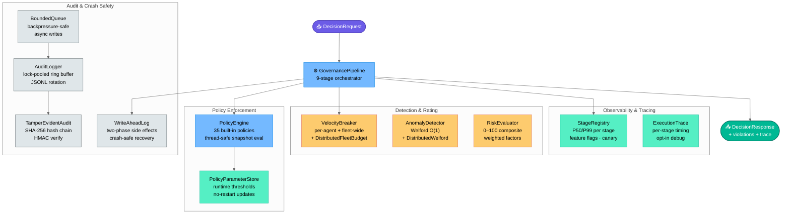
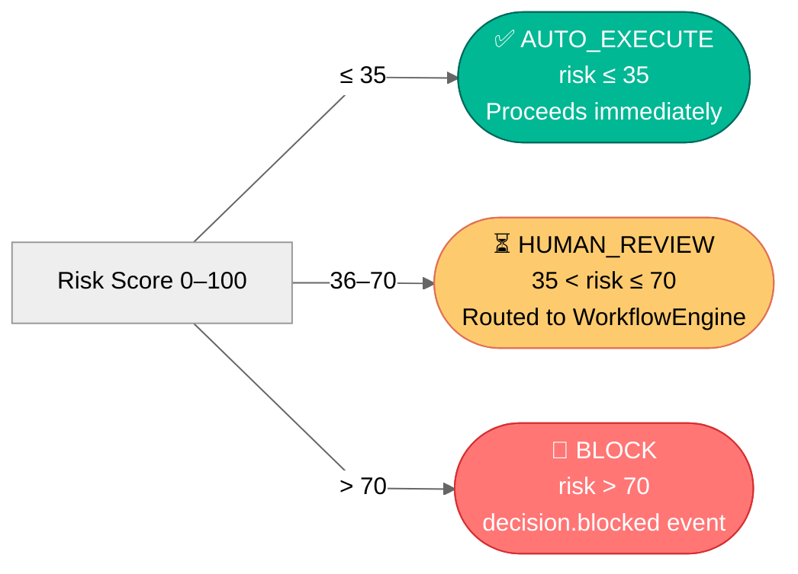
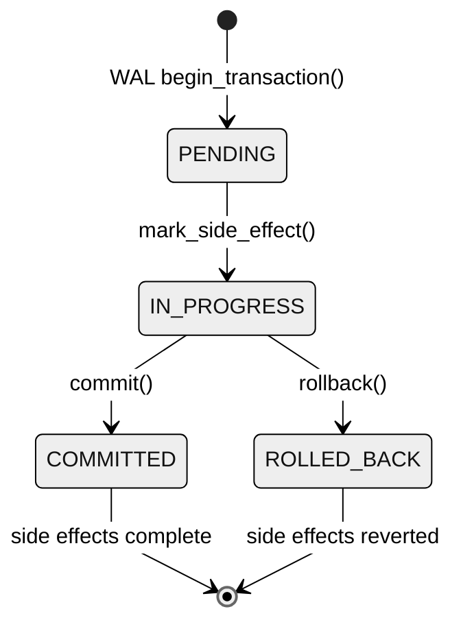

# glassbox/governance — Core Governance Engine

The `governance` package contains the 9-stage pipeline and all 32 stage components.



| Module | Role |
|---|---|
| `pipeline.py` | `GovernancePipeline` — the central 9-stage orchestrator |
| `models.py` | All dataclasses and enums (`DecisionRequest`, `AuditRecord`, …) |
| `policy_engine.py` | Thread-safe policy registry + evaluator (35 built-in policies) |
| `policy_parameters.py` | `PolicyParameterStore` — runtime policy threshold updates without restart |
| `risk_evaluator.py` | Weighted composite risk scoring (0–100) |
| `anomaly_detector.py` | Welford Z-score baselines; `DistributedAnomalyDetector` (Redis-backed) |
| `velocity_breaker.py` | Per-agent + ecosystem circuit breakers; `DistributedFleetBudgetPolicy` (Redis) |
| `stage_registry.py` | `StageRegistry` — feature flags, canary rollout, P50/P99 latency per stage |
| `write_ahead_log.py` | `WriteAheadLog` — crash-safe two-phase side-effect tracking |
| `advanced_audit.py` | `TamperEvidentAuditLogger` — HMAC/SHA-256 hash-chained immutable audit |
| `audit_logger.py` | `AuditLogger` — in-memory ring buffer + JSONL file persistence |
| `bounded_queue.py` | `BoundedQueue` — backpressure-safe async audit write queue |
| `event_dispatcher.py` | `EventDispatcher` — fan-out governance events to handlers |
| `schema_validator.py` | Payload structure validation per decision type |
| `decision_replay.py` | Sync + async + parallel batch replay |
| `retry_policy.py` | Sync + async retry with configurable backoff |
| `context_capture.py` | Platform-safe metadata enrichment |
| `logging_manager.py` | `GlassBoxLogger` — JSON/text, rotating, `GLASSBOX_LOG_LEVEL` |
| `execution_trace.py` | Per-stage timing and outcome trace (opt-in) |
| `simulator.py` | `PolicySimulator` — dry-run policy impact analysis |
| `multitenancy.py` | `TenantRegistry` + `MultiTenantPipeline` — quota enforcement, context isolation |
| `access_control.py` | Enterprise RBAC — role hierarchy, permission caching, impersonation audit |
| `encryption.py` | AES-256-GCM field-level encryption + PBKDF2 password hashing |
| `api_gateway.py` | Middleware pipeline — auth, rate-limit, CORS, validation |
| `request_context.py` | Thread-local context — multi-tenant isolation, distributed tracing |
| `threadpool_config.py` | `ThreadPoolConfig` — async worker pool sizing and management |
| `enterprise_pipeline.py` | `EnterprisePipeline` — full-stack production wrapper with all modules |
| `trust.py` | `TrustLevel` — agent trust chain validation and scoring |
| `explainer.py` | `DecisionExplainer` — natural-language decision rationale |
| `currency.py` | `CurrencyConverter` — multi-currency amount normalisation |
| `idempotency.py` | `IdempotencyStore` — request deduplication guard |

See [../../docs/ARCHITECTURE.md](../../docs/ARCHITECTURE.md) for pipeline diagrams.

---

## Quick Start

```python
from glassbox.governance.pipeline import GovernancePipeline
from glassbox.governance.models import DecisionRequest, DecisionType

pipeline = GovernancePipeline()
response = pipeline.process(DecisionRequest(
    agent_id="my_agent",
    decision_type=DecisionType.PROCUREMENT,
    payload={"amount": 50_000, "supplier_id": "SUP-001"}
))

print(f"Status: {response.final_status}")  # FinalStatus.EXECUTED
print(f"Latency: {response.pipeline_latency_ms}ms")
```

---

## Disposition Routing at a Glance



---

## Distributed Mode (Redis-backed, v1.2.0)

For **multi-replica deployments** where fleet budget or anomaly baselines must be shared:

```python
import redis
from glassbox.governance.velocity_breaker import DistributedFleetBudgetPolicy
from glassbox.governance.anomaly_detector import DistributedAnomalyDetector, RedisAnomalyStore

redis_client = redis.Redis(host="redis", port=6379, decode_responses=True)

# Shared cumulative fleet budget across all replicas
fleet_policy = DistributedFleetBudgetPolicy(
    budget=1_000_000.0,
    period_hours=24,
    redis_client=redis_client,
)
pipeline.policy_engine.register(fleet_policy.as_policy())
fleet_policy.record_execution(amount)  # call after decision executes

# Shared Welford baselines across all replicas
store = RedisAnomalyStore(redis_client=redis_client, namespace="prod")
dist_detector = DistributedAnomalyDetector(store=store)
pipeline = GovernancePipeline(anomaly_detector=dist_detector)
```

Both classes fall back to in-process state if Redis is unavailable.

---

## Runtime Policy Parameter Updates (v1.2.0)

Update sanctions lists and policy thresholds at runtime — no restart needed:

```python
from glassbox.governance.policy_parameters import _param_store

# Update sanctioned countries list for PROC-006
_param_store.set("PROC-006", "sanctioned_countries", ["IR", "KP", "SY", "XX"],
                 updated_by="compliance_officer")

# Changes take effect on the next policy evaluation — no restart required
```

---

## Stage Latency Tracking (v1.2.0)

`pipeline.health()` now returns per-stage P50/P99 latency:

```python
health = pipeline.health()
# health["stage_latency_p50_ms"] → {"policy_enforcement": 0.05, "anomaly_detection": 0.04, ...}
# health["stage_latency_p99_ms"] → {"policy_enforcement": 0.22, "anomaly_detection": 0.18, ...}

# Or get raw stats:
stats = pipeline.stage_latency_stats()
# {"policy_enforcement": {"p50_ms": 0.05, "p99_ms": 0.22, "samples": 1000}, ...}
```

---

## WAL + Idempotent Workflow Create (v1.2.0)

The `WriteAheadLog` tracks finalize-time side effects. `WorkflowEngine.create_from_decision()` is idempotent — safe for WAL crash-recovery replay:



```python
# If pipeline crashes mid-finalize and restarts:
pipeline = GovernancePipeline(recover_wal_on_startup=True)
# WAL replays PENDING/IN_PROGRESS entries — WorkflowEngine.create_from_decision()
# returns the existing workflow instead of creating a duplicate.
```

---

## Configuration Examples

### Strict Mode (Safety-First)

```python
pipeline = GovernancePipeline(
    trace_enabled=True,            # detailed per-stage info
    async_audit_writes=False,      # synchronous auditing
    environment="production"
)
```

### Permissive Mode (High-Throughput)

```python
pipeline = GovernancePipeline(
    trace_enabled=False,           # skip tracing for speed
    async_audit_writes=True,       # non-blocking audit
    anomaly_detector=None          # disable anomaly detection
)
```

### Full Production Setup

```python
from glassbox.store.database_abstraction import DatabaseFactory
from glassbox.events.event_bus import EventBus
from glassbox.compliance.catalogue import ComplianceCatalogue

repos = DatabaseFactory.create("sqlite", db_path="/var/lib/glassbox/glassbox.db")
bus   = EventBus()

pipeline = GovernancePipeline(
    audit_repo=repos.audit_repo(),
    compliance_catalogue=ComplianceCatalogue(),
    event_bus=bus,
    trace_enabled=True,
    async_audit_writes=True,
    recover_wal_on_startup=True,
)
```

---

## Decision Types (10 domains)

| Decision Type | Key Policies | Domain |
|---|---|---|
| `PROCUREMENT` | PROC-001–006 | Supply chain, supplier management |
| `PRICING` | PRICE-001–004 | Dynamic pricing, floor/ceiling |
| `FINANCIAL` | FIN-001–005 | Transfers, BSA, GDPR Art.22 |
| `INVENTORY` | — | Stock management |
| `IT_OPS` | IT-OPS-002–004 | Change windows, destructive actions |
| `LOGISTICS` | LOG-001 | Shipment approvals |
| `HR` | HR-001–003 | Compensation, data rights |
| `CUSTOM` | — | User-defined |
| `CLINICAL` | CLIN-001–002, AI-001, SECURITY-001 | Dosage safety, trial protocols |
| `TRADING` | TRADE-001–002, AI-001, SECURITY-001 | Position limits, algorithmic braking |

---

## Performance Characteristics

| Operation | Latency P50 | Latency P99 | Throughput | Notes |
|-----------|-------------|-------------|-----------|-------|
| Full 9-stage pipeline | 0.10 ms | 0.18 ms | 5,500 decisions/sec | Single thread, no DB |
| With SQLite audit | 0.15 ms | 0.25 ms | 4,000 decisions/sec | Includes DB write |
| Policy evaluation (all 35) | 0.05 ms | 0.12 ms | 8,000 evals/sec | Cached policies |
| Anomaly detection check | 0.02 ms | 0.05 ms | 20K checks/sec | Welford O(1) |
| Velocity breaker check | 0.03 ms | 0.08 ms | 15K checks/sec | Sliding window |
| Risk scoring | 0.04 ms | 0.10 ms | 10K scores/sec | All factor extractors |

---

## Thread-Safety Model

| Component | Lock type | Scope |
|---|---|---|
| `AnomalyDetector._stats` | `threading.RLock` | All reads and writes |
| `PolicyEngine._policies` | `threading.RLock` | register, disable, evaluate |
| `AuditLogger._records` | `threading.Lock` | append, snapshot |
| `AuditLogger._file_locks` | per-path `threading.Lock` | JSONL file writes |
| `VelocityBreaker._windows` | per-agent `threading.Lock` | sliding window |
| `VelocityBreaker._ecosystem` | `threading.Lock` | ecosystem deque |
| `GovernancePipeline._contracts` | `threading.RLock` | contract registry |
| `GlassBoxLogger._loggers` | `threading.Lock` | double-checked locking |
| `TenantRegistry._tenants` | `threading.RLock` | tenant create/lookup |
| `StageRegistry._stage_latencies` | `threading.Lock` | P50/P99 sample buffer |

`process()` and `process_async()` are stateless per-request — safe from any number of concurrent threads.

---

---

## Known Limitations (v1.2.0)

| Component | Issue | Severity | Mitigation |
|---|---|---|---|
| `audit_logger.py` | Async queue full raises `RuntimeError` — no sync fallback | HIGH | Use `async_audit_writes=False` under burst load |
| `policy_engine.py` | No timeout guard on custom policy rule evaluation — hung rule blocks pipeline | HIGH | Wrap custom rules with `ThreadPoolExecutor.submit(...).result(timeout=...)` in user code |
| `multitenancy.py` | `tenant_id` path validation does not verify resolved path stays inside `GLASSBOX_LOG_DIR` | MEDIUM | Restrict tenant IDs to `[a-z0-9_-]+` before passing to API |
| `access_control.py` | `set_parent()` permits circular role inheritance; `get_all_permissions()` returns incomplete set | LOW | Validate role DAG at setup time; cycle doesn't cause exceptions |
| `policy_engine.py` | Policy lookup is O(N) — degrades at 1000+ custom policies | LOW | Acceptable at 35 built-in; add `decision_type` index at 100+ custom policies |
| `anomaly_detector.py` | Welford `M2` uses `max(0.0, ...)` to mask precision loss after 1M+ evictions | LOW | Periodic recalibration (`reset_baseline()`) in long-running processes |

See [../../CHANGELOG.md](../../CHANGELOG.md) for the full post-1.2.0 improvement plan.

---

See [../../docs/ARCHITECTURE.md](../../docs/ARCHITECTURE.md) for pipeline diagrams and [../../docs/DEPLOYMENT.md](../../docs/DEPLOYMENT.md) for production deployment patterns.


