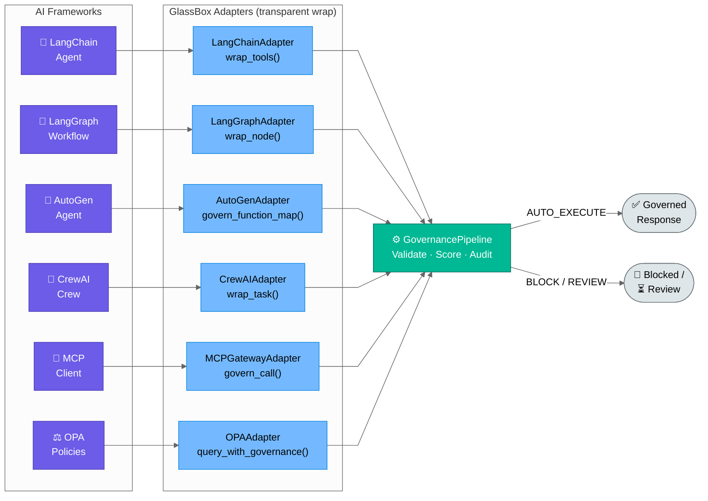
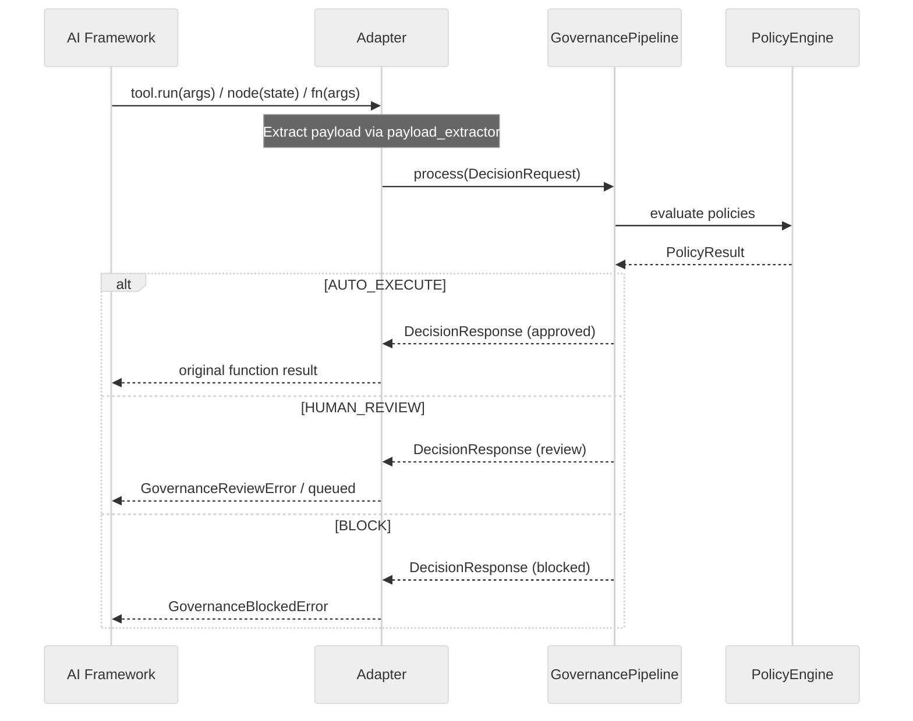

# glassbox/integrations — AI Framework Adapters

The `integrations` package provides native adapters for popular AI frameworks and policy engines.

| Module | Role |
|---|---|
| `adapters.py` | `LangChainAdapter`, `LangGraphAdapter`, `AutoGenAdapter`, `GenericToolAdapter` |
| `extended_adapters.py` | `CrewAIAdapter`, extended AutoGen multi-agent patterns |
| `mcp_gateway.py` | `MCPGatewayAdapter` — Model Context Protocol gateway integration |
| `opa_adapter.py` | `OPAAdapter` — Open Policy Agent policy engine bridge |

**Every tool call / graph node / function is automatically governed — transparent to the AI framework.**



### How the Adapter Wrap Works



---

## Quick Start

```python
from glassbox.integrations.adapters import (
    LangChainAdapter,
    LangGraphAdapter,
    AutoGenAdapter,
    GenericToolAdapter
)
from glassbox.governance.pipeline import GovernancePipeline

pipeline = GovernancePipeline(environment="production")
```

---

## Framework Integration Patterns

### Pattern 1: LangChain Tool Governance

```python
from langchain.agents import Tool
from glassbox.integrations.adapters import LangChainAdapter
from glassbox.governance.pipeline import DecisionType

# Original tools
def get_bank_balance(account_id: str) -> str:
    return f"${balance}"

def transfer_money(from_account: str, to_account: str, amount: float) -> str:
    return "Transfer complete"

tools = [
    Tool(name="get_balance", func=get_bank_balance),
    Tool(name="transfer", func=transfer_money),
]

# Wrap with governance
adapter = LangChainAdapter(pipeline, agent_id="financial_agent")
governed_tools = adapter.wrap_tools(
    tools,
    decision_type=DecisionType.FINANCIAL,
    payload_extractor=lambda tool, args: {"amount": args.get("amount", 0)}
)

# Use in LangChain agent (transparent)
agent = initialize_agent(governed_tools, llm, agent="zero-shot-react-description")
response = agent.run("Transfer $5000 to account 123")
# Behind the scenes: transfer_money is governed through pipeline
```

### Pattern 2: LangGraph Node Governance

```python
from langgraph.graph import StateGraph
from glassbox.integrations.adapters import LangGraphAdapter
from glassbox.governance.pipeline import DecisionType

def approval_node(state):
    """LangGraph node for approval decisions"""
    return {"approved": True, "amount": state["amount"]}

def invoice_node(state):
    """LangGraph node for invoice generation"""
    return {"invoice_id": "INV-001"}

# Wrap nodes with governance
adapter = LangGraphAdapter(pipeline)

governed_approval = adapter.wrap_node(
    func=approval_node,
    agent_id="approval_bot",
    decision_type=DecisionType.PROCUREMENT,
    payload_extractor=lambda state: {"amount": state.get("amount")}
)

governed_invoice = adapter.wrap_node(
    func=invoice_node,
    agent_id="invoice_bot",
    decision_type=DecisionType.PROCUREMENT
)

# Build graph (transparent to LangGraph)
graph = StateGraph(StateType)
graph.add_node("approval", governed_approval)
graph.add_node("invoice", governed_invoice)
graph.add_edge("approval", "invoice")

runner = graph.compile()
result = runner.invoke({"amount": 50000})
# Both nodes governed automatically
```

### Pattern 3: AutoGen Function Map Governance

```python
from autogen import AssistantAgent, UserProxyAgent
from glassbox.integrations.adapters import AutoGenAdapter
from glassbox.governance.pipeline import DecisionType

def place_order(item_id: str, quantity: int) -> str:
    """AutoGen-callable function"""
    return f"Order placed: {quantity} x {item_id}"

def cancel_order(order_id: str) -> str:
    """AutoGen-callable function"""
    return f"Order {order_id} cancelled"

# Map functions to agent
function_map = {
    "place_order": place_order,
    "cancel_order": cancel_order,
}

# Wrap with governance
adapter = AutoGenAdapter(pipeline, agent_id="autogen_assistant")
governed_map = adapter.govern_function_map(
    function_map,
    decision_type=DecisionType.PROCUREMENT,
    payload_extractor=lambda fname, args: {"action": fname, "amount": args.get("amount", 0)}
)

# Use in AutoGen agents
assistant = AssistantAgent(
    name="assistant",
    llm_config={"config_list": [{"model": "gpt-4", "api_key": "..."}]},
    function_map=governed_map
)

user_proxy = UserProxyAgent(name="user", human_input_mode="NEVER")
user_proxy.initiate_chat(assistant, message="Place 100 orders for item ABC")
# All function calls governed automatically
```

### Pattern 4: Generic Function Decorator

```python
from glassbox.integrations.adapters import GenericToolAdapter
from glassbox.governance.pipeline import DecisionType

adapter = GenericToolAdapter(pipeline)

# Decorate any function
@adapter.govern(
    agent_id="my_agent",
    decision_type=DecisionType.FINANCIAL
)
def transfer_funds(amount: float, account: str) -> dict:
    """Any callable function"""
    return {"status": "success", "amount": amount}

@adapter.govern(
    agent_id="my_agent",
    decision_type=DecisionType.DATA_ACCESS
)
def query_customer_data(customer_id: str) -> dict:
    """Functions are governed before execution"""
    return {"customer_id": customer_id, "data": {...}}

# Call normally; governance happens transparently
result = transfer_funds(5000, "account-123")
# Behind: governed through pipeline
```

---

## Performance Characteristics

| Operation | Latency | Throughput | Notes |
|-----------|---------|-----------|-------|
| Tool wrap overhead() | <1 ms | — | One-time at initialization |
| Governed tool execution | +2–10 ms | 100–1K tools/sec | Adds governance overhead |
| Node wrap overhead() | <1 ms | — | One-time per node |
| Governed node execution | +5–20 ms | 50–500 nodes/sec | Adds governance + async |
| Function decorator overhead | <1 ms | — | One-time decoration |
| Decorated function execution | +1–5 ms | 200–2K calls/sec | Minimal overhead |

**Scaling:**
```python
# Use async adapters for high throughput
adapter = LangChainAdapter(pipeline, async_mode=True)
governed_tools = adapter.wrap_tools(tools, async_mode=True)

# Batch governance for multiple tools
adapters = [LangChainAdapter(pipeline) for _ in range(10)]
batches = [tools[i::10] for i in range(10)]
governed = [adapter.wrap_tools(batch) for adapter, batch in zip(adapters, batches)]
```

---

## Common Errors

### Error: "Adapter not initialized; governance not active"

**Symptom:**
```python
# Forgot to wrap tools
tools = [tool1, tool2]
agent = initialize_agent(tools, llm)  # Tools NOT governed

# Decision made without governance
result = agent.run("Transfer $10000")
```

**Solution:**
```python
# Always wrap before use
adapter = LangChainAdapter(pipeline, agent_id="agent_id")
governed_tools = adapter.wrap_tools(tools, decision_type=DecisionType.FINANCIAL)

agent = initialize_agent(governed_tools, llm)
# Now governance is active
```

### Error: "Payload extractor returned None; cannot evaluate policy"

**Symptom:**
```python
adapter = LangChainAdapter(pipeline, agent_id="agent")
governed_tools = adapter.wrap_tools(
    tools,
    decision_type=DecisionType.FINANCIAL,
    payload_extractor=lambda tool, args: None  # Wrong!
)

result = agent.run("Transfer $1000")
# Error: Cannot evaluate governance without payload
```

**Solution:**
```python
# Implement correct payload extractor
def extract_payload(tool, args):
    if tool.name == "transfer":
        return {"amount": float(args.get("amount", 0))}
    elif tool.name == "query":
        return {"query": args.get("query", "")}
    return {}

governed_tools = adapter.wrap_tools(
    tools,
    payload_extractor=extract_payload
)
```

### Error: "LangGraph node incompatible; state schema mismatch"

**Symptom:**
```python
adapter = LangGraphAdapter(pipeline)
governed_node = adapter.wrap_node(
    func=my_node,
    agent_id="agent",
    decision_type=DecisionType.PROCUREMENT
)

graph = StateGraph(MyStateType)
graph.add_node("step1", governed_node)
# Error: Node output incompatible with state schema
```

**Solution:**
```python
# Ensure node maintains state schema
def my_node_with_state(state: MyStateType) -> MyStateType:
    # Process
    result = my_logic()
    
    # Return updated state (not just result)
    return {**state, "approval": result}

adapter = LangGraphAdapter(pipeline)
governed_node = adapter.wrap_node(
    func=my_node_with_state,
    agent_id="agent"
)
```

### Error: "AutoGen framework not installed; adapter unavailable"

**Symptom:**
```python
from glassbox.integrations.adapters import AutoGenAdapter
# ImportError: No module named 'autogen'
```

**Solution:**
```python
# Install AutoGen optional dependency
# pip install autogen-agentchat

# OR check which adapters available
from glassbox.integrations.adapters import get_available_adapters
adapters = get_available_adapters()
print(f"Available: {adapters}")  # ['LangChain', 'LangGraph', ...]
```

### Error: "Decision routed to human review; agent blocked"

**Symptom:**
```python
result = agent.run("Transfer $1,000,000")
# Governance blocked: amount exceeds policy limit
# Decision routed to human review
# Agent execution stopped
```

**Solution:**
```python
# Option 1: Implement graceful handling in agent
try:
    result = agent.run("Transfer $1,000,000")
except GovernanceBlockedError as e:
    return f"Cannot complete: {e.message}. Escalated for human review."

# Option 2: Use fallback agent for high-value decisions
if amount > HIGH_THRESHOLD:
    result = escalate_to_human_agent(amount, beneficiary)
else:
    result = automatic_agent.run(...)

# Option 3: Pre-check against policy before routing to agent
policy_check = pipeline.policy_engine.evaluate(payload)
if policy_check.disposition == "block":
    return "This action is not permitted by policy"
```

---

## Multi-Framework Setup

```python
from glassbox.governance.pipeline import GovernancePipeline
from glassbox.integrations.adapters import (
    LangChainAdapter,
    LangGraphAdapter,
    AutoGenAdapter
)

pipeline = GovernancePipeline(environment="production")

# All adapters use same pipeline
lc_adapter = LangChainAdapter(pipeline)
lg_adapter = LangGraphAdapter(pipeline)
ag_adapter = AutoGenAdapter(pipeline)

# Decisions made in any framework are consistently governed
lc_result = lc_agent.run("...")
lg_result = lg_graph.invoke({...})
ag_result = ag_agent.run(...)

# All logged in same audit trail
audit_records = pipeline.audit_repo.list_all()
```

---

See [../../docs/USECASES.md](../../docs/USECASES.md) Patterns 7 & 8 for LangChain and LangGraph integration examples, and [../../CONTRIBUTING.md](../../CONTRIBUTING.md) for adding support for new frameworks.


