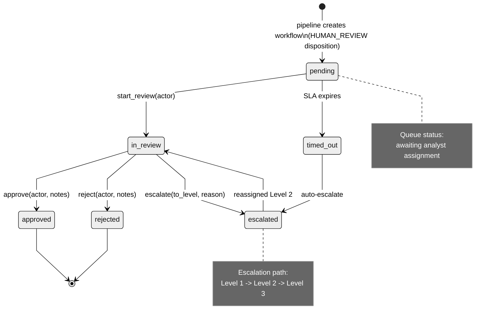

# glassbox/workflow — Approval Workflow Engine

The `workflow` package manages the lifecycle of decisions requiring human review.

| Module | Role |
|---|---|
| `workflow_engine.py` | `WorkflowEngine`, `WorkflowInstance`, `WorkflowStep`, SLA monitoring |

**Workflow states:** `pending` → `in_review` → `approved` / `rejected` / `escalated`

**Features:**
- SLA timer monitoring (background thread, opt-in)
- Auto-escalation on SLA breach
- Per-step audit trail
- Queue statistics and dashboard support
- **Idempotent `create_from_decision()`** — safe for WAL crash-recovery replay (v1.2.0)



---

## Quick Start

```python
from glassbox.workflow.workflow_engine import WorkflowEngine

# Initialize with 60-minute SLA for manual review
wfe = WorkflowEngine(default_sla_minutes=60, monitor_sla=True)

# List pending workflows
pending = wfe.list_pending()
for workflow in pending:
    print(f"Workflow {workflow.id}: {workflow.status} (SLA expires in {workflow.sla_remaining_min}m)")

# Analyst reviews and approves
wfe.approve(
    workflow_id="WF-12345",
    actor="analyst@example.com",
    notes="Verified contract and supplier clearance"
)

# Manager reviews and rejects
wfe.reject(
    workflow_id="WF-12346",
    actor="manager@example.com",
    notes="Supplier on exclusion list"
)

# Escalate if SLA breached
if workflow.sla_breached():
    wfe.escalate(workflow_id, to_level=2, reason="SLA Timeout")
```

---

## Idempotent Workflow Creation (v1.2.0)

`WorkflowEngine.create_from_decision(decision_id, ...)` is now idempotent. If a workflow already exists for the given `decision_id`, the existing `WorkflowInstance` is returned instead of creating a duplicate:

```python
# First call — creates new workflow
wf1 = wfe.create_from_decision("DEC-001", decision_type=..., payload=...)

# Second call (e.g., WAL replay after crash) — returns existing workflow
wf2 = wfe.create_from_decision("DEC-001", decision_type=..., payload=...)

assert wf1.workflow_id == wf2.workflow_id  # same instance
```

This makes the WorkflowEngine safe for use inside WAL crash-recovery replay sequences.

---

## Performance Characteristics

| Operation | Latency | Throughput | Notes |
|-----------|---------|-----------|-------|
| create_workflow() | 1–2 ms | — | New metadata written to store |
| list_pending() | 5–20 ms | — | 100–500 workflows searched |
| approve() | 2–5 ms | 200 approvals/sec | Audit trail + state update |
| list_sla_breached() | 10–30 ms | — | Scans pending by time |
| SLA monitor loop | 100–500 ms | — | Checks every N seconds (tunable) |

**Tuning SLA Monitor:**
```python
# Frequent SLA checks (better responsiveness, higher CPU)
wfe = WorkflowEngine(sla_check_interval_seconds=5)

# Infrequent checks (lower CPU, delayed escalation)
wfe = WorkflowEngine(sla_check_interval_seconds=60)
```

---

## Common Errors

### Error: "Workflow state transition invalid"

**Symptom:**
```python
workflow.status = "approved"  # Direct assignment
wfe.approve(workflow.id)  # Error: Cannot transition from pending→approved
```

**Cause:** Attempting invalid state transition; must go through `in_review` first

**Solution:**
```python
# Correct state machine: pending → in_review → approved
# Move to review first
wfe.move_to_review(workflow_id)

# Then approve
wfe.approve(workflow_id, actor="analyst@example.com")
```

### Error: "SLA timer expired before actor could review"

**Symptom:**
```
Workflow WF-001 auto-escalated to Level 2 (timer expired)
```

**Cause:** SLA timer limit reached while workflow pending

**Solution:**
```python
# Option 1: Increase SLA for long-review workflows
wfe = WorkflowEngine(default_sla_minutes=240)  # 4 hours instead of 1 hour

# Option 2: Manually extend SLA for specific workflow
wfe.extend_sla(workflow_id, additional_minutes=120)

# Option 3: Disable SLA monitoring for specific workflow type
wfe.create_workflow(
    decision_id="DEC-001",
    monitored=False  # Skip SLA checks
)
```

### Error: "Actor not authorized to approve"

**Symptom:**
```
PermissionError: actor 'junior_analyst@example.com' cannot approve Level 2 escalations
```

**Cause:** Actor lacks authorization for the escalation level

**Solution:**
```python
# Option 1: Use authorized actor
wfe.approve(workflow_id, actor="senior_analyst@example.com", notes="Approved")

# Option 2: Check authorization before attempting action
from glassbox.workflow.workflow_engine import UserRole

actor_role = UserRole.get_role("junior_analyst@example.com")
if actor_role.can_approve_level(2):
    wfe.approve(workflow_id, actor="junior_analyst@example.com")
else:
    wfe.route_to_escalation()  # Route to authorized approver
```

### Error: "SLA monitor thread crashed"

**Symptom:**
```
Exception in SLA monitor thread: Connection to database failed
Workflows no longer being escalated automatically
```

**Cause:** Background SLA monitor thread crashed due to database / filesystem error

**Solution:**
```python
# Restart SLA monitor
wfe.start_sla_monitor()

# OR: Manually check and escalate overdue workflows
import time
for workflow in wfe.list_pending():
    age_minutes = (time.time() - workflow.created_at) / 60
    if age_minutes > workflow.sla_minutes:
        wfe.escalate(workflow.id, reason="Manual escalation: SLA timeout")
```

---

## Multi-Level Escalation Pattern

```python
# Level 1: Analyst (60 min SLA)
wfe_l1 = WorkflowEngine(default_sla_minutes=60, level=1)

# Level 2: Senior analyst (120 min SLA)
wfe_l2 = WorkflowEngine(default_sla_minutes=120, level=2)

# Level 3: Manager (480 min SLA, no auto-escalate)
wfe_l3 = WorkflowEngine(default_sla_minutes=480, level=3, monitor_sla=False)

# When L1 SLA expires → auto-escalate to L2
# When L2 SLA expires → auto-escalate to L3
# When L3 SLA expires → alert ops team (no auto-escalate)
```

---

See [../governance/pipeline.py](../governance/pipeline.py) for pipeline integration and [../../docs/DEPLOYMENT.md](../../docs/DEPLOYMENT.md) for SLA monitoring in production.


